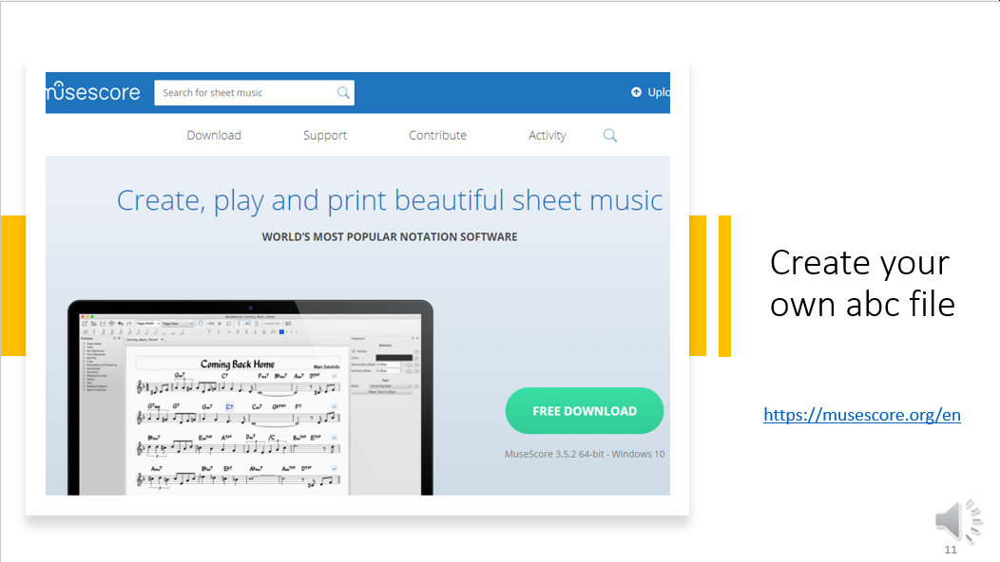
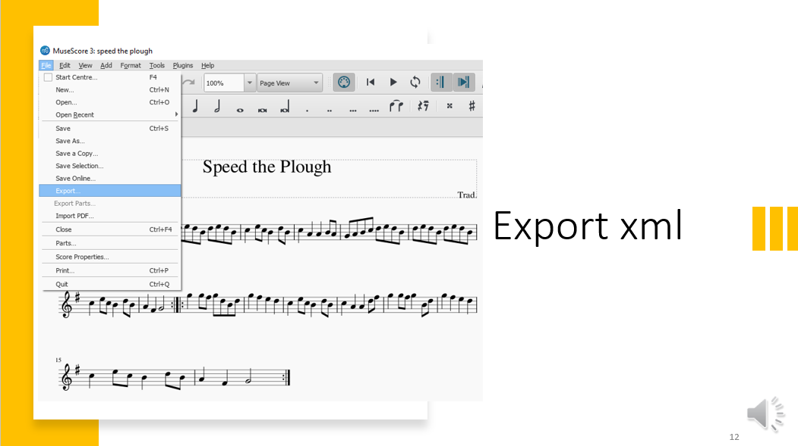
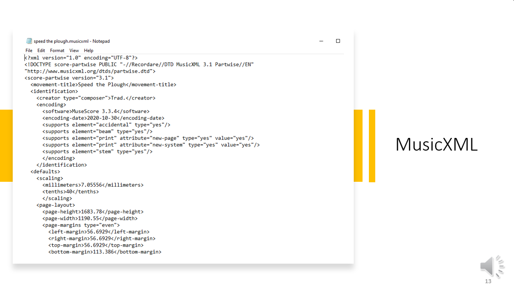
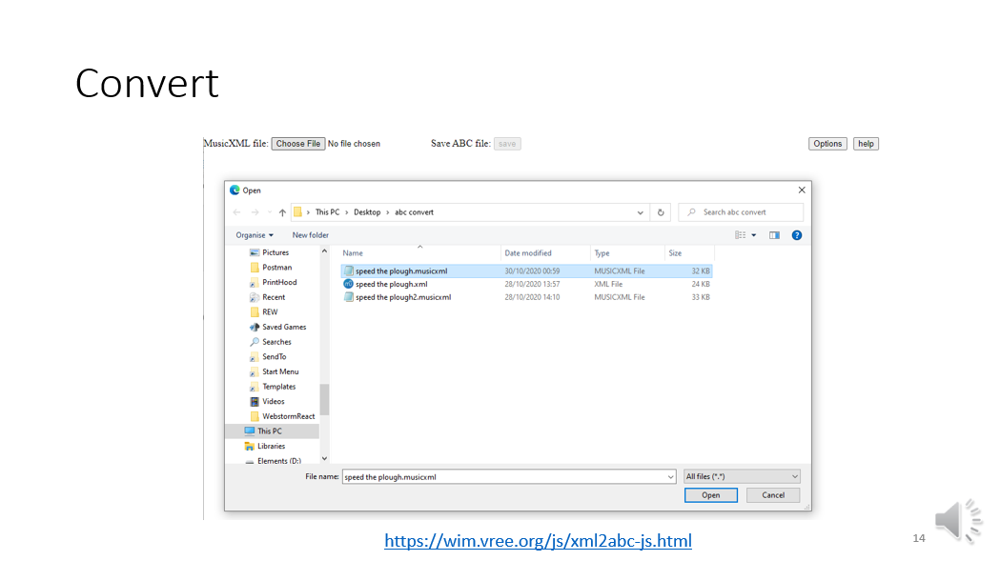
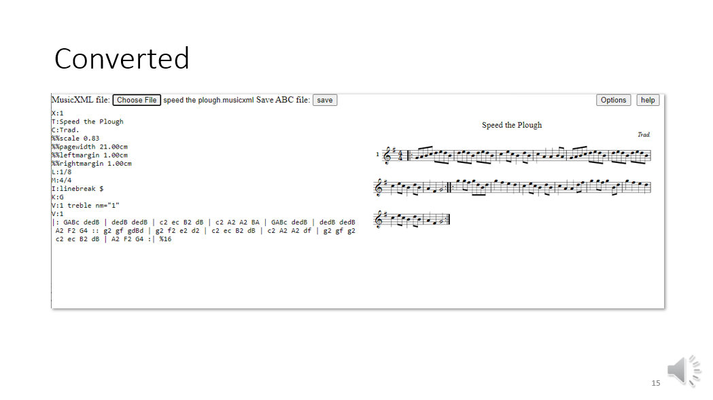
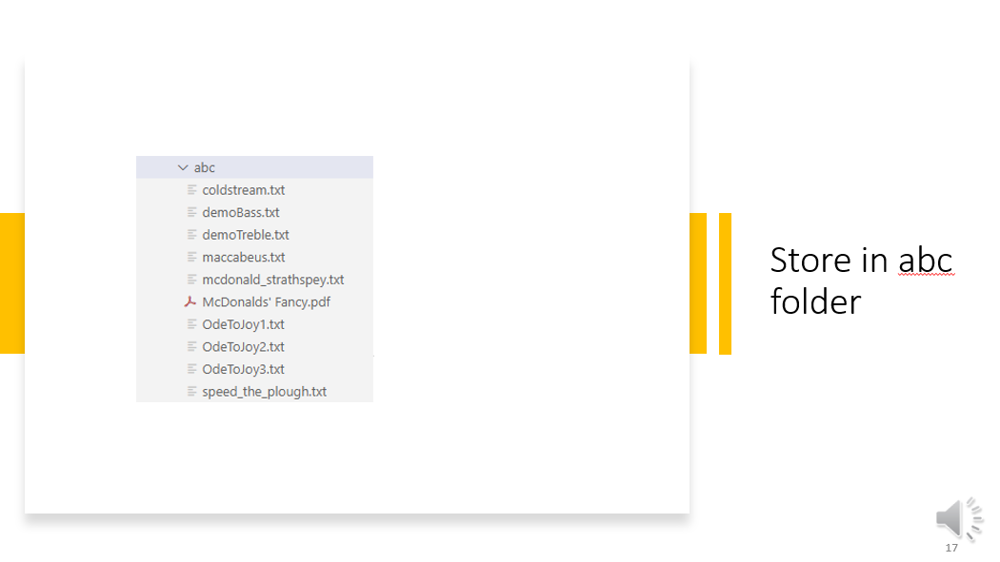

# Write music and convert to mdv format.

We now need a route to create music and convert it into a format which is easy for chuck to read back.

Watch the week 8 abc video starting 33mins 12 seconds in skipping the details of the ABC file format just to see how to create and use the format.

## Producing ABC Format

Download and run MuseScore as a music editor.



There are tutorials which explain how to enter notes in musical score.
Version 3.6 is current and I am looking forward to the release of version 4 soon. 



Write a simple tune on a single line of music.  Do not use any chords or any fancy features such as 1st and secont time bars.  No lyrics or chord symbols.  My code to read abc files is pretty accurate, but it can't cope with embellishments.

Export to the oldest version of musicXML which muse score will allow, this makes the simplest file format.



Even so the music xml format is too complex.  It contains information for typesetting as well as the musical content.



Present your xml file to the converter at the [wim.vree.org](https://wim.vree.org/js/xml2abc-js.html)

This is a fairly plain looking website, but it does the job.



The converted text may still contain some formatting text that we don't want.  Use the text editor on the site to remove all lines with %% on and also any text between the key signature line K: and the start of the music.



On your folder you should have the program abcConverter.ck and two subfolders, abc and mdv.

When the file has been tidied, store it as a .txt file in the abc folder.

You can inspect the demo abc files already in the folder.  The file should be simple and human readable.

```
X:1
T:Speed the Plough
M:4/4
L:1/8
C:Trad.
K:G
|:GABc dedB|dedB dedB|c2ec B2dB|c2A2 A2BA|
  GABc dedB|dedB dedB|c2ec B2dB|A2F2 G4:|
|:g2gf gdBd|g2f2 e2d2|c2ec B2dB|c2A2 A2df|
  g2gf g2Bd|g2f2 e2d2|c2ec B2dB|A2F2 G4:|
```

## converting ABC to MDV

MDV is not an official standard format, it is just an ordered list of numbers in a format I have designed to make the music easily readable to chuck.

I have provided a library code file abcConverter.ck which will read the abc file from the abc folder and produce an mdv file of a similar name in the mdv folder.  You can scan down the code, but you do not need to study the detail here.

```c
//abc converter v 1.2
// converts simple abc to text file ready for chuck.
// plays back on a sine wave as a check
// edit the abcfile string to match your chosen input
// name is passed in argument following : symbol
// fixed !f! dynamics. %8 bar counts and B3/2 dotted rhythms
//chuck abcconverter.ck:name

"abc/abc.txt"    => string abcfile;
"mdv/mdv.txt"    => string chuckfile;
```

The filenames listed here are just default values, they will be replaced by the filename you pass as an argument when you run the program.

```c
if(me.args()){
    "abc/"+ me.arg(0)+".txt" => abcfile;
    "mdv/"+ me.arg(0)+".txt" => chuckfile;
}    


int melNotes[1];
int myDurs[1];
float myVelocities[1];
ABCreader myReader;
myReader.readFile(melNotes, myDurs, myVelocities, abcfile);
stash(melNotes, myDurs, myVelocities, chuckfile);

// playback as check

120 => float tempo; //bpm

(60/(tempo * 192)) :: second => dur tick;

SinOsc s => dac;
0.2 => s.gain ;
player(melNotes, myDurs, myVelocities);


// --------------------- functions ----------------//

function void stash (int notes[], int durations[], float velocities[], string filename ){
    // flags: READ_WRITE, READ, WRITE, APPEND, BINARY, ASCII combine with | bitwise or.
    me.sourceDir() + "/" + filename => string filepath;
    FileIO datafile;
    datafile.open(filepath, FileIO.WRITE | FileIO.ASCII  );
    datafile.write(melNotes.cap());
    datafile.write("\n");
    for( 0 => int i; i < notes.cap(); i++ ){datafile.write(notes[i]);datafile.write("\n");}
    for( 0 => int i; i < notes.cap(); i++ ){datafile.write(durations[i]);datafile.write("\n");}
    for( 0 => int i; i < notes.cap(); i++ ){datafile.write(velocities[i]);datafile.write("\n");}
    datafile.close();
}


function void player(int N[], int D[], float V[]){
    for (0 =>int index; index < N.cap(); index ++){ //for each element of the array
        Std.mtof(N[index])      => s.freq;
        V[index]   * 0.2    => s.gain;
        D[index] * tick  => now;
    }
}


//-------- library Function -- do not modify -----------------//

class ABCreader  {  // supports reading abc file with one line of music.  !decorations not supported! velocity 0 or 1.
    
     // variable to read into
    string str;
    string char0;
    string char1;
    //abc metadata
    string area,book,composer,discography, fileurl,group,history,instruction, key;
    string macro, notes, origin, parts, tempo, rhythm, remark, source,symbol,T; 
    string user,voice, words1, words2, X, transcription;
    int Ls[2];
    int M[2];
    
    [0,1,2,4,5,6,7,8] @=> int N[];
    int value;
    int D[8];// durations in ticks
    float V[1];// velocities  
    192 => int tick;
    tick =>  int L;
    
    
    [81,83,72,74,76,77,79] @=> int midiHi[];// a5 b5 c5 d5 e5 f5 g5
    [ 0, 0, 0, 0, 0, 0, 0 ] @=> int keySig[];
    
    //Major keys
    int keys[30][7];
    [ 1, 1, 1 ,1, 1, 1, 1 ] @=> keys["C#"] @=> keys["A#m"];// abcdefg
    [ 1, 0, 1, 1, 1, 1, 1 ] @=> keys["F#"] @=> keys["D#m"];// abcdefg
    [ 1, 0, 1, 1, 0, 1, 1 ] @=> keys["B"]  @=> keys["G#m"];// abcdefg
    [ 0, 0, 1, 1, 0, 1, 1 ] @=> keys["E"]  @=> keys["C#m"];// abcdefg
    [ 0, 0, 1, 0, 0, 1, 1 ] @=> keys["A"]  @=> keys["F#m"];// abcdefg
    [ 0, 0, 1, 0, 0, 1, 0 ] @=> keys["D"]  @=> keys["Bm"];// abcdefg
    [ 0, 0, 0, 0, 0, 1, 0 ] @=> keys["G"]  @=> keys["Em"];// abcdefg
    [ 0, 0, 0, 0, 0, 0, 0 ] @=> keys["C"]  @=> keys["Am"];// abcdefg
    [ 0,-1, 0, 0, 0, 0, 0 ] @=> keys["F"]  @=> keys["Dm"];// abcdefg
    [ 0,-1, 0, 0,-1, 0, 0 ] @=> keys["Bb"] @=> keys["Gm"];// abcdefg
    [-1,-1, 0, 0,-1, 0, 0 ] @=> keys["Eb"] @=> keys["Cm"];// abcdefg
    [-1,-1, 0,-1,-1, 0, 0 ] @=> keys["Ab"] @=> keys["Fm"];// abcdefg
    [-1,-1, 0,-1,-1, 0,-1 ] @=> keys["Db"] @=> keys["Bbm"];// abcdefg
    [-1,-1,-1,-1,-1, 0,-1 ] @=> keys["Gb"] @=> keys["Ebm"];// abcdefg
    [-1,-1,-1,-1,-1,-1,-1 ] @=> keys["Cb"] @=> keys["Abm"];// abcdefg
    
    0 => int accidental; // sharp flat
    0 => int octave;// up down +- 12
    1 => float lengthen; // broken rhythms
    0 => int natural; // true false
    1 => float velocity; // range 0 - 1 
    0 => float tuplet ;// tuplet ratios
    0 => int tupcount; // tuplet notes
    0 => int dotted; // dotted notes
    
    
    // control variables
    0 => int state;//0 metadata, 1 notes
    0 => int i;
    
    
    function void readFile(int Nn[], int Dd[], float Vv[], string abcFileName){
        Nn @=> N;
        Dd @=> D;
        Vv @=> V;
        <<<"N array", Nn[0]>>>;
        me.sourceDir() + "/" + abcFileName => string filename;
        FileIO abc;
        abc.open( filename, FileIO.READ );
        
        if( !abc.good() )
        {
            cherr <= "can't open file: " <= filename <= " for reading..."
            <= IO.newline();
            me.exit();
        }
        
        // loop until end
        while( abc.more() )
        {
            abc.readLine() => str;
            if (state == 1) this.readNoteData();  
            if (state == 0) this.readMetaData();  
        }
        // loop over the entire array
        for( 0 => int i; i < N.cap(); i++ )
        {
            // do something (debug print)
            //<<< N[i] ,D[i] >>>;  // print resulting arrays
    }
}


function void readMetaData(){
    int temp;
    readString();
    //chout <= char0 <= IO.newline();
    if (char0 == "X"){// return first character of string usually x:1
        readString(); // skip : 
        readString();
        Std.atoi(char0) => int X; 
        <<< "found X:", X >>>;
        return ;
    }
    if (char0 == "A"){
        readString(); // skip : 
        str => area; 
        //chout <= char0 <= IO.newline(); 
        <<< "found area:", area >>>;
        return;   
    }
    if (char0 == "B"){
        readString(); // skip : 
        str => book; 
        //chout <= char0 <= IO.newline(); 
        <<< "found book:", book >>>;
        return;   
    }  
    if (char0 == "C"){
        readString(); // skip : 
        str => composer; 
        //chout <= char0 <= IO.newline(); 
        <<< "found composer:", composer >>>;
        return;   
    } 
    if (char0 == "D"){
        readString(); // skip : 
        str => discography; 
        //chout <= char0 <= IO.newline(); 
        <<< "found discography:", discography >>>;
        return;
    }
    if (char0 == "F"){
        readString(); // skip : 
        str => fileurl; 
        //chout <= char0 <= IO.newline(); 
        <<< "found fileurl:", fileurl >>>;
        return;   
    }  
    if (char0 == "G"){
        readString(); // skip : 
        str => group; 
        //chout <= char0 <= IO.newline(); 
        <<< "found group:", group >>>;
        return;   
    } 
    if (char0 == "H"){
        readString(); // skip : 
        str => history; 
        //chout <= char0 <= IO.newline(); 
        <<< "found history:", history >>>;
        return;
    }
    if (char0 == "I"){
        readString(); // skip : 
        str => instruction; 
        //chout <= char0 <= IO.newline(); 
        <<< "found instruction:", instruction >>>;
        return;
    }
    if (char0 == "L"){ // unit of beat
        readString(); // skip :       
        readString();
        if (char0 == " ")readString();
        Std.atoi(char0) => int temp => Ls[0];
        readString(); // skip /       
        readString();
        Std.atoi(char0) =>  temp => Ls[1];        
        //chout <= char0 <= IO.newline(); 
        <<< "found unit note length:", Ls[0],"/",Ls[1] >>>;
        tick * 4 * Ls[0] / Ls[1] => L;
        return;     
    } 
    if (char0 == "M"){
        readString(); // skip :       
        readString();
        if (char0 == " ")readString();
        if(char0 =="C"){ // common and cut common
            if (char1 == "|"){
                2 => M[0];
                2 => M[1];
                }else{
                4 => M[0];
                4 => M[1];    
             };
         }else{
            Std.atoi(char0) => int temp => M[0];
            readString(); // skip /       
            readString();
            Std.atoi(char0) =>  temp => M[1];
        }
        // chout <= char0 <= IO.newline(); 
        <<< "found Meter:", M[0],"/",M[1] >>>;
        return;
    }
    if (char0 == "m"){
        readString(); // skip : 
        str => macro; 
        //chout <= char0 <= IO.newline(); 
        <<< "found macro:", macro >>>;
        return;
    }
    if (char0 == "N"){
        readString(); // skip : 
        str => notes; 
        //chout <= char0 <= IO.newline(); 
        <<< "found notes:", notes >>>;
        return;
    }
    if (char0 == "O"){
        readString(); // skip : 
        str => origin; 
        //chout <= char0 <= IO.newline(); 
        <<< "found origin:", origin >>>;
        return;
    }
    if (char0 == "P"){
        readString(); // skip : 
        str => parts; 
        //chout <= char0 <= IO.newline(); 
        <<< "found parts:", parts >>>;
        return;
    }
    if (char0 == "Q"){
        readString(); // skip : 
        str => tempo; 
        //chout <= char0 <= IO.newline(); 
        <<< "found tempo:", tempo >>>;
        return;
    }
    if (char0 == "R"){
        readString(); // skip : 
        str => rhythm; 
        //chout <= char0 <= IO.newline(); 
        <<< "found rhythm:", rhythm >>>;
        return;
    }
    if (char0 == "r"){
        readString(); // skip : 
        str => remark; 
        //chout <= char0 <= IO.newline(); 
        <<< "found remark:", remark >>>;
        return;
    }
    if (char0 == "s"){
        readString(); // skip : 
        str => parts; 
        //chout <= char0 <= IO.newline(); 
        <<< "found parts:", parts >>>;
        return;
    }
    if (char0 == "T"){
        readString(); //  skip :   
        str => T; 
        //chout <= char0 <= IO.newline(); 
        <<< "found title:", T >>>;
        return;
        
    }
    if (char0 == "U"){
        readString(); //  skip :   
        str => user; 
        //chout <= char0 <= IO.newline(); 
        <<< "found user:", user >>>;
        return;
        
    }
    if (char0 == "V"){
        readString(); //  skip :   
        str => voice; 
        //chout <= char0 <= IO.newline(); 
        <<< "found voice:", voice >>>;
        return;
        
    }
    if (char0 == "W"){
        readString(); //  skip :   
        str => words1; 
        //chout <= char0 <= IO.newline(); 
        <<< "found words1:", words1 >>>;
        return;
        
    }
    if (char0 == "w"){
        readString(); //  skip :   
        str => words2; 
        //chout <= char0 <= IO.newline(); 
        <<< "found words2:", words2 >>>;
        return;
        
    }
    if (char0 == "Z"){
        readString(); //  skip :   
        str => transcription; 
        //chout <= char0 <= IO.newline(); 
        <<< "found transcription:", transcription >>>;
        return;
        
    }
    
    if (char0 == "K"){
        readString(); //  skip : 
        readString();
        if (char0 == " ")readString();
        char0 => key;     
        if ((char1 =="#") || (char1 =="b") || (char1 =="m")){
            key + char1 => key;        
        }
        readString();     
        if ((char1 =="m")){
            key + char1 => key;        
        }
        keys[key] @=> keySig;    
        <<< "found key:", key >>>;
        1 => state;  // K represents end of metadata
        return;
    }   
}

function void readNoteData(){
    //<<< "Data Line :" , str>>>;
    int temp;
    while(str.length() > 0){
        readString();
        <<< "data: ",char0, char0.charAt(0)  >>>; 
        //chout <= char0 <= IO.newline(); 
        // Notes and rests
        if ((char0.charAt(0) >= 97) && (char0.charAt(0) <= 103)){//lowercase a-g
            midiHi[char0.charAt(0) - 97]+ accidental => value;  
            if (natural == 0) keySig[char0.charAt(0) - 97] +=> value;
            N << value; 
            if (tupcount > 0){ 
                tuplet => lengthen ;
                <<< "catch tuplet: ", tupcount, tuplet, (L * lengthen) $ int >>>;  
                1 -=> tupcount;
            }
            //<<<  char0, ": ",N[N.cap()-1] ,(L * lengthen) >>>;
            D << (L * lengthen) $ int;  
            V << velocity;
            0 => accidental => natural;
            1 => lengthen;
            continue;
        }   
        if ((char0.charAt(0) >= 65) && (char0.charAt(0) <= 71)){//uppercase A-G
            midiHi[char0.charAt(0) - 65] - 12 + accidental => value;  
            if (natural == 0) keySig[char0.charAt(0) - 65] +=> value;
            N<< value;        
            if (tupcount > 0){ 
                tuplet => lengthen ;
                <<< "catch tuplet: ", tupcount, tuplet, (L * lengthen) $ int  >>>;  
                1 -=> tupcount;
            }
            //<<<  char0, ": ",N[N.cap()-1] ,(L * lengthen) >>>;   
            D << (L * lengthen) $ int; 
            V << velocity;
            0 => accidental => natural;
            1 => lengthen;
            continue;
        }  
        if ((char0 == "x") || (char0 == "z")){//rest
            N<< 1; 
            <<<  char0, ": ",N[N.cap()-1] >>>; 
            D << L; 
            V << 0;
            0 => accidental => natural;
            1 => lengthen;
            continue;
        }    
 
        
        // timing elements
        
        if (char0 == "/"){// number note length
            if((char1.charAt(0) >= 48) && (char1.charAt(0) <= 57)){
                 D[ D.cap() - 1]/ (char1.charAt(0) - 48) $ int => D[ D.cap() - 1];       
                readString(); // used two characters
            }else{
                (0.5  * D[ D.cap() - 1]) $ int => D[ D.cap() - 1]; 
            }
            continue;
        }
        if ((char0.charAt(0) >= 48) && (char0.charAt(0) <= 57)){// number note length
            Std.atoi(char0)  *=> D[ D.cap() - 1];// only one digit accounted
            continue;
            // check this befor triplets
        } 
        if (char0 == "("){<<<"bracket">>>;// slur or duplet triplet  
            if(char1 == "2") {
                1.5   => tuplet ;
                2 => tupcount;
                readString(); // used two characters
                <<< "set duplet" >>>;
            }// 2 in 3
            if(char1 == "3") {
                1/1.5 => tuplet ;
                3 => tupcount;
                 readString(); // used two characters
                <<< "set triplet" >>>;
            }// 3 in 2
           
        // else not implemented
        continue;  
        } 
        if (char0 == ">"){// broken rhythm normal
            (D[ D.cap() - 1] * 1.5 ) $ int => D[ D.cap() - 1];
            0.5 => lengthen;
            continue;
        } 
        if (char0 == "<"){// broken rhythm snap
            (D[ D.cap() - 1] * 0.5 ) $ int => D[ D.cap() - 1];
            1.5 => lengthen;
            continue;
        }           
               
        
        // pitch elements
        if (char0 == "^"){// sharp
            accidental++;
            continue;
        } 
        if (char0 == "_"){// flat
            accidental--; 
            continue; 
        } 
        if (char0 == "="){// natural
            1 => natural;
            continue;
        } 
        if (char0 == "'"){// octave up
            12 +=> N[ N.cap() - 1];
            continue;
        }   
        if (char0 == ","){// octave down
            12 -=> N[ N.cap() - 1];
            continue;
        }   
        
        // articulation elements
        if (char0 == ")"){// slur off
            //not implemented
            continue;
        } 
        if (char0 == "."){// staccato
            //not implemented
            continue;
        }
        
        
        // structure elements
        
        
        if (char0 == "|"){// barline
            continue;
            //not implemented
        }    
        if (char0 == ":"){// repeat
            continue;
            //not implemented
        } 
        if (char0 == " "){// space
            continue;
            //not implemented 
        } 
          if (char0 == "%"){// ignore %n bar count on line
            readString(); // used two characters
            continue;
            //not implemented 
        } 
        if (char0 == "!"){// ignore !f! dynamics
            do{
                readString(); // used two characters
            } until (char0 == "!");
            continue;
            //not implemented 
        } 
      
        
    } // end while loop  
    return;
  }// end function readnotedata
  
  
  function void readString( ){
      if (str.length()>0){
          str.substring(0,1) => char0;
      }else{  " " => char0 ;}   
      
      if (str.length()>1){//
          str.substring(1,1) => char1;
          str.substring(1) => str;
      }else{
          " " => char1;
          ""  => str;
      }     
      //chout <= char0 <= IO.newline(); // for debugging
   }
  
  
} // end class ABCreader

```

There is a demo ABC file in the abc folder OdeToJoy1.txt  to convert this to MDV run the converter replacing the name with the sample file name (without the .txt extension)

> chuck abcconverter.ck:OdeToJoy1

The following output will appear in the terminal as the abc file is read and the melodyu will play back on a default sound to confirm the conversion.

```code
PS C:\Users\derek\Documents\Github\Chuck-21\code17\G Convert music to MDV> chuck abcconverter.ck:OdeToJoy1
N array 0 
found X: 1 
found title: Title 
found composer: Composer 
found unit note length: 1 / 4 
found Meter: 4 / 4 
found instruction: linebreak $ 
found key: C 
data:  e 101 
data:    32 
data:  e 101 
data:    32
data:  f 102
data:    32
data:  g 103
```

A file with a similar name should appear in the mdv folder **OdeToJoy.txt*** and this contains numbers which we will see being played back in the next section.

```code
64
0
76
76
77
79
79
77
76
74
72
72
74
76
76
74
74
76
76
77
79
79 ...
```