# Playback polyphonic notes with control

## Midi Commands 

The bare minimum that you need to know about MIDI 1.0 is the code representing note on and off and the continuous controllers.

Playing a note on a piano keyboard will send MIDI note on and note off commands.

Moving a slider, turning a dial or pressing a button on a control keyboard will typically send a continuous controller message.  The continuous controller number will depend on the particular slider dial or button actioned.  The continuous controller value will be a number 0-127 determined by the position of the dial of slider or the state of the button.

It is possible to combine continuous controllers as pairs to send two numbers 0 - 127 which are linked to provide a range 0 - (2<sup>15</sup> -1).

The cc numbers associated with controls are determined by individual manufacturers and do not follow intuitive patterns.

Midi messages are typically made up of three bytes.  The first one is often a command (identified by a 1 in bit position 7). The next two are usually data which has meaning in the context of the command.

### note off

Note off is identified a command byte followed by three zeros.  The last four bytes detemine the MIDI channel 0 - 15 (usually labelled 1-16 on hardware controllers).

So a note off on channel 0 (hardware channel 1) is denoted by 

```code
10000000
```
Which is expressed in hexadecimal notationas 0x80

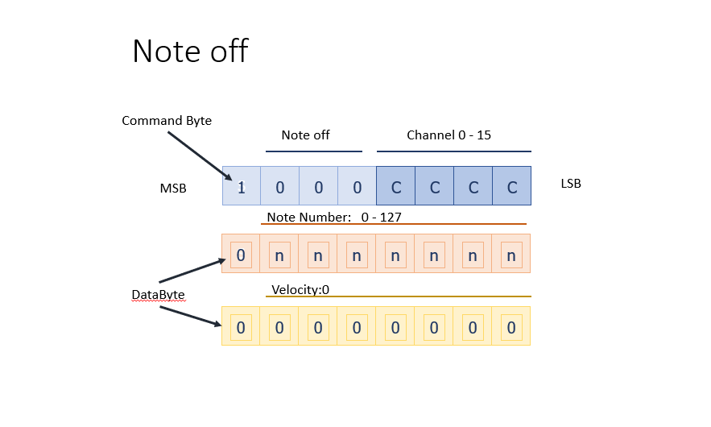

The data bytes which follow are identified by a zero in the first position (bit 7) and the remaining 7 bits provide the value.  Thus the largest value which can be expressed is binary 1111111 or decimal 127.

For note off the first data byte identifies the MIDI note number and the second is the velocity (usually zero for note off).

### note on

Note on is identified by a 1 in bit position 5.

So a note on on channel 0 (hardware channel 1) is denoted by 

```code
10010000
```
Which is expressed in hexadecimal notationas 0x90

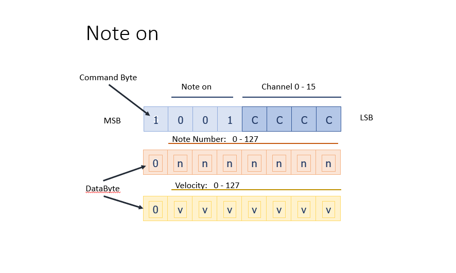

Now the velocity data ranges 0 - 127 reflecting the velocity of the keypress.

### continuous controller

The continuous controller is identified by a 1 in bit positions 4 and 5.

So a note on on channel 0 (hardware channel 1) is denoted by 

```code
10110000
```
Which is expressed in hexadecimal notationas 0xB0

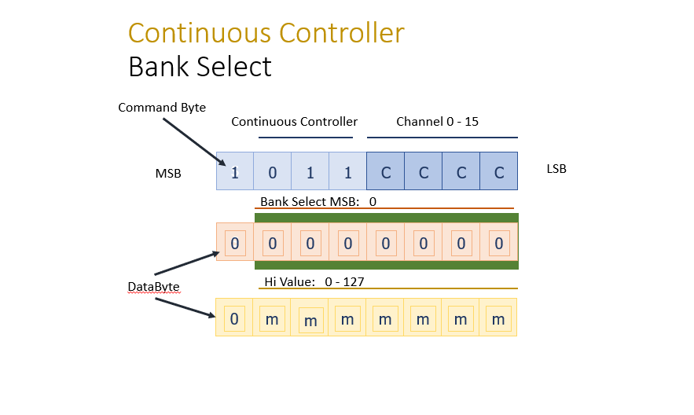

The first databyte represents the continuous controller number and the second data byte represents the value.

The figure here illustrates this as the high value, but this is only important when continuous controllers are used as linked pairs, which is not usually the case for controller keyboards.

## Novation Keyboard

The continuous controller numbers relating to the novation keyboards in H104 are shown in these figures.

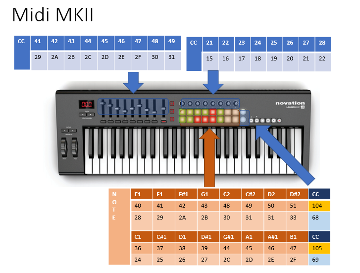

Note that the sliders start with continuous controller number decimal 41 or 0x29.

The dials start with continuous controller number 21 decimal or 0x15.

The pressure pads represent midi notes, but on a different midi channel to the piano keyboard.

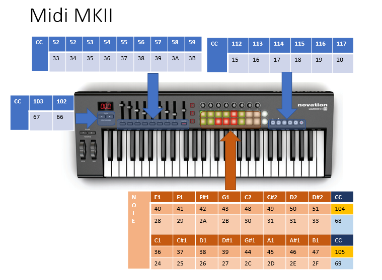

The continuous controllers associated with the buttons below the sliders start at continuous controller decimal 52.

The full details are shown.

My demo software is written to match this keyboard. If you have a different keyboard at home you will need to edit the software to match your keyboards controller pattern.  (Avoid using the oxygen keyboards in H104).

## Processing GUI

If you don't have a controller keyboard and want to test the operation of the chuck polyphonic software you can use a graphic user interface GUI9 which I have written using the programming language processing.

You will need to [download processing](https://processing.org/download) to run this.  My GUI was written on processing 3 but I have tested it and it also works on processing 4 beta.  The code will run on Mac or PC.

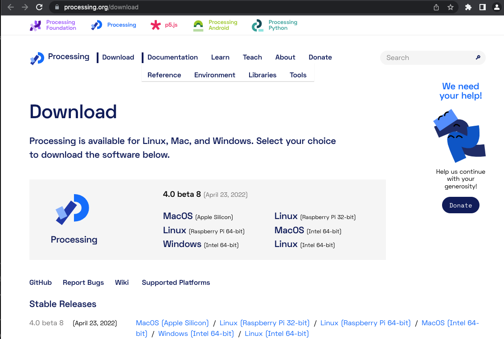

Take care to download the version which matches your machine and processor.  This Beta version 4.8 bet 8 is ok to use.

Unzip this to your machine and run processing.  You should be presented with a blank editor screen.

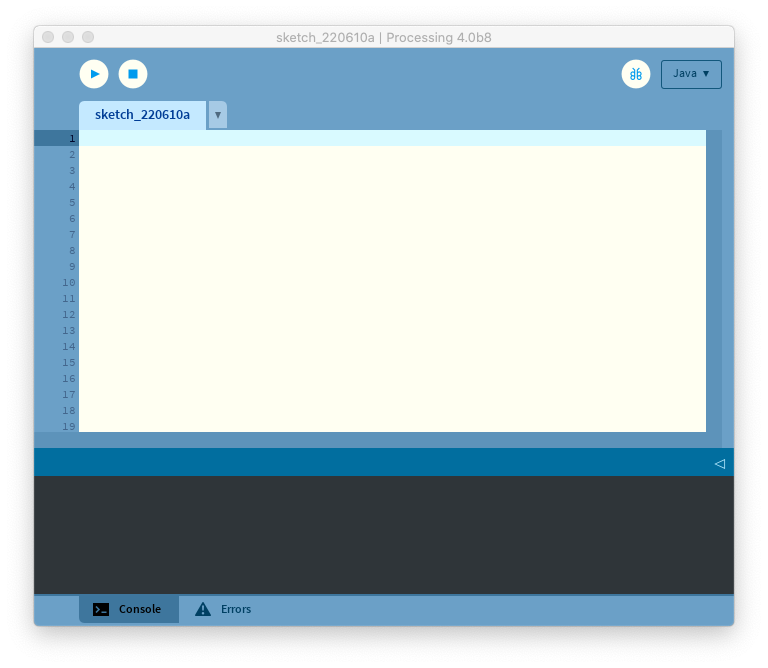

At the top of the screen open the menu: Sketch | Import Library | Manage libraries

Search for the oscP5 library and install this.

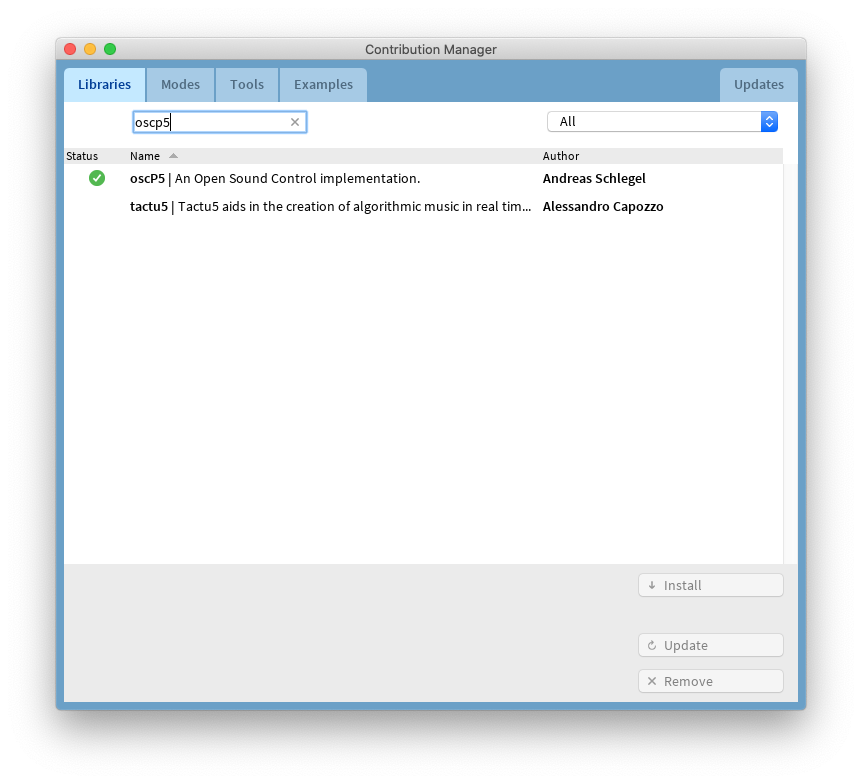

In the code19 download files, find the gui_9osc folder and copy this to a convenient location on your machine.  In the documents folder for instance.

In the folder you will find a file named gui9_osc.pde it is essential within processing that the name of the main file matches the name of the enclosing folder.

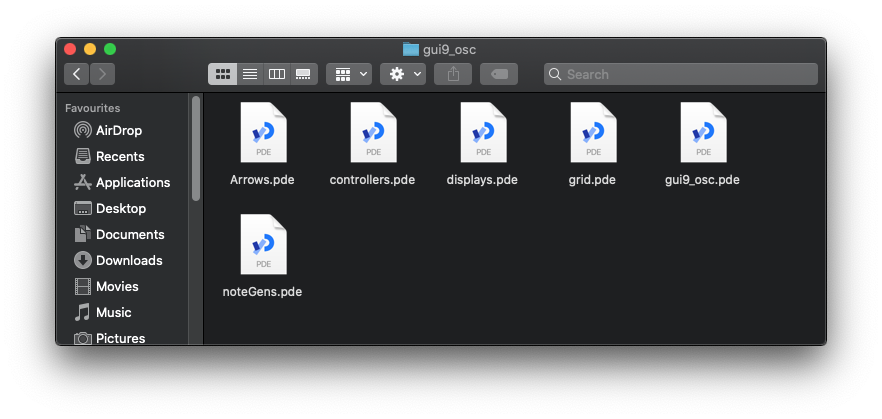

Within processing, file | open the file gui9_osc.pde and all the associated files will also be loaded into the processing editor.

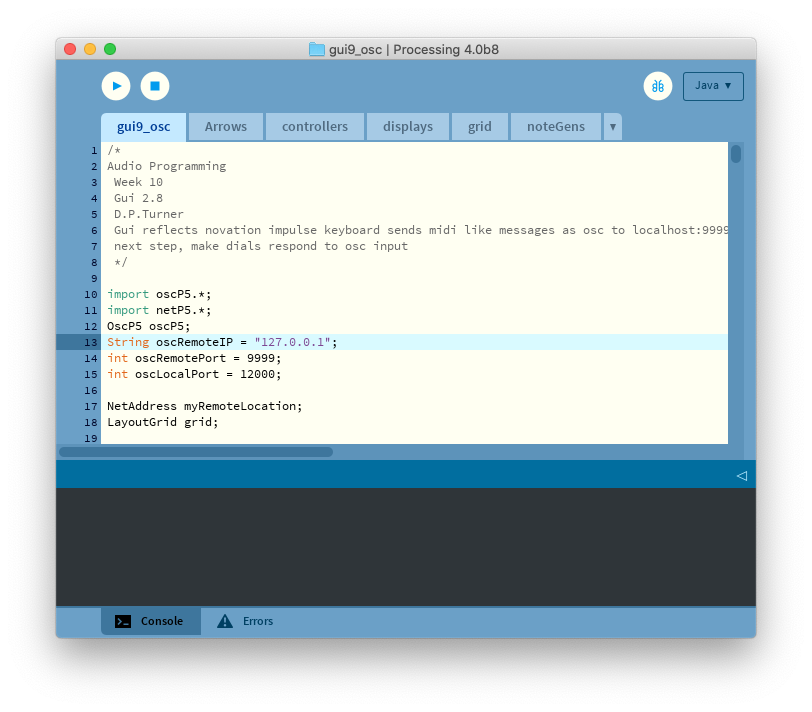

YOu can see that the code depends on the library which has just been imported.  You don't need to know the detail of this code.

Press the "play" triangle icon to run the programme.

The programme will dispay a resizeable piano keyboard which uses osc in the backgraound to send messages to chuck which emulate the novation keyboard.  The main limitation is that you can only play one key at once even though the program to be developed will be polyphonic.

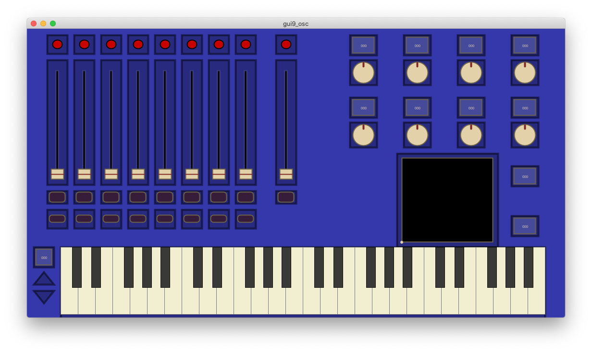

You can leave this program quietly running in the background.