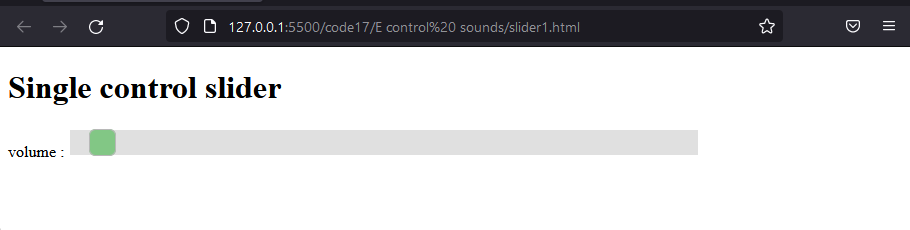
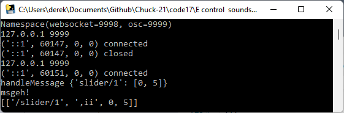
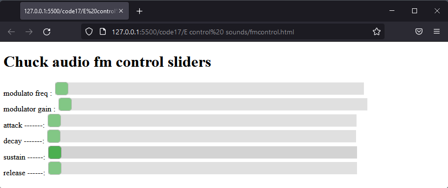

# Control Sounds from HTML sliders

So far the sound parameters applied to a patch have been stated in the programme so that once started the programmed sound cannot be changed.

The goal in this section is to create HTML sliders which can be used to control sounds while a program is running.

The use of HTML sliders is a step on the way towards using physical sliders on a MIDI keyboard.

## HTML sliders

In this example a web page is created which will transmit the value of its single slider out from a websocket.

You don't need to know the inner workings of the programme it is enough just to be able to follow the code which represents the slider.
```HTML
<!DOCTYPE HTML>

<html>
   <head>
  
      <script type = "text/javascript">
````
The script tag identifies a section of javaScript language within an HTML page.

```javascript
      var msg =  {
                     "slider/1":[0, 0]
      }

      var ws = new WebSocket("ws://localhost:9998");
         
      function  onload(){
         
         ws.onopen = function() {
         };
         ws.onclose = function() { 
         };
         ws.onmessage = function (evt) { 
            var received_msg = evt.data;
         };
         
      }      
      function WebSocketSend() {
            ws.send(JSON.stringify(msg));
         }
```
The msg variable determines the format of the message which will be delivered to chuck when the slider is moved.

The Websocket at port 9998 will be used and this number will be used by the bridge which follows.

```HTML         
    </script>
    <style>
       .slidecontainer {
            width: 100%; /* Width of the outside container */
        }

        /* The slider itself */
        .slider {
            -webkit-appearance: none;  /* Override default CSS styles */
            appearance: none;
            width: 70%; /* Full-width */
            height: 25px; /* Specified height */
            background: #d3d3d3; /* Grey background */
            outline: none; /* Remove outline */
            opacity: 0.7; /* Set transparency (for mouse-over effects on hover) */
            -webkit-transition: .2s; /* 0.2 seconds transition on hover */
            transition: opacity .2s;
        }

        /* Mouse-over effects */
        .slider:hover {
         opacity: 1; /* Fully shown on mouse-over */
        }

        /* The slider handle (use -webkit- (Chrome, Opera, Safari, Edge) and -moz- (Firefox) to override default look) */
        .slider::-webkit-slider-thumb {
            -webkit-appearance: none; /* Override default look */
            appearance: none;
            width: 25px; /* Set a specific slider handle width */
            height: 25px; /* Slider handle height */
            background: #4CAF50; /* Green background */
            cursor: pointer; /* Cursor on hover */
        }

        .slider::-moz-range-thumb {
            width: 25px; /* Set a specific slider handle width */
            height: 25px; /* Slider handle height */
            background: #4CAF50; /* Green background */
            cursor: pointer; /* Cursor on hover */
        }
    </style>
```
The style section determines how the slider will appear on screen with a green background.

```HTML
   </head>
 
   <body onload = "onload();" >
      <div id = "sse">
         <H1 >Single control slider</H1>

         <div class="slidecontainer">
            <label for="mySlider1">volume : </label>
            <input type="range" min="0" max="127" value="00" class="slider" id="mySlider1" oninput ="msg['slider/1'][1] = parseInt(this.value); WebSocketSend();">
```
The important section is contained within a div of class slidecontainer.  There is only one slider here but this can easily be scaled up to several sliders.

The label will just help you identify what sound parameter you want the slider to affect, but it is only a label and can be changed as you like.

The input object is the slider itself and the function of the input element is controlled by a nubmer ao attributes arranged as name value pairs.

Type range makes the input appear as a slider (other options include number boxes).

Min and max set the value the slider will output over its range.  I hav chosen 0 - 127 to mirror the range of MIDI 1.0 control paramenters.

Value sets the slider position when the page loads.

Class slider just identifies the slider to the stylesheet so that the green background can be applied.

All HTML element must have a unique id which javascript can use to interact with them.

The oninput element determines the action when the slider is moved.  Its' value is converted to an integer and stored in the message array.  WebSocketSend then causes the messages from all the sliders on the page to be sent out.


```HTML            
            <br>
         </div>
      </div>   
   </body>
</html>
```
It is important in an HTML page that all the <> brackets on the elements which surround content have a matching </>.  <br> does not have any content, it simply indicates a line break.

To start the HTML Page make sure that you have the Live Server extension added to visual studio.  Then you can right click over the HTML code and "open in Live Server".

 

 ## Recieving and responding to control messages

 The messages from the slider are sent as calls to a function in the receiving sound file **SoundSineCTRL** which is copied into **Sound.ck**

 ```c
 public class Sound extends Chubgraph
{
   1 => float volumeMax;
   0 => float volumeMin;
```
The simplest thin I can control with my one slider is volume.  It is good to define the max and minimum values which each controlled value should take.  This can be used later to scale the input from the slider (0 - 127) to the usefull range of the controlled parameter, in this case volume (0 - 1).

```c

   SinOsc s => Gain volume => outlet;
    0 => s.gain ;
    1 => volume.gain;
   
   function void noteOn(float vel ){0.2 => s.gain;}
   
   function void noteOff(float vel){0.0 => s.gain;}
   
   function void setFreq(float Hz){Hz => s.freq;}
```
The sound patch has a Gain named volume placed between the sinewave oscillator and the outlet.  It will be this volume.gain which is controlled by the slider.

```c  

 //=========== custom functions =============================
  
   // edit to set effect of each slider 
   function void oscSlider(int sliderNo, float value){  // value 0 - 127
        if(sliderNo == 0){ volumeMin + ((volumeMax - volumeMin) * value/127 )  => volume.gain;<<< value >>>;}   
   }                                  
} 
 ```
 Below the unchanged noteOn(), noteOff() and setFreq() functions a custom function is added named oscSlider.

 Note that this is inside the final closing bracket which encloses the Sound class.

 The oscSlider function will be called from another file and passed a slider number and a float value.  In this case there is only one slider so this will be number 0.  The value was set to be 1 - 127 in the range of the HTML slider.

 The equation to scale values looks a bit complicated, but it means scale the incoming value to the range of the controlled variable and add on the minimum value (in this case zero).  A pattern has been set here which can be duplicated for other controlled variables.

 ### The glue for communication

 The two programmes above are the only ones where you need to make any edits what remains is library code to provide the communications route from the HTML slider to the sound patch.

#### Bridge

 The first essential is the bridge.  You will find two executables in the bridge folder downloaded in code 17, one is for PC and one for Mac.  In the lab you may need a password to enable the bridge on the Mac if it has not previously been installed.

 A bridge needs to be held up on both sides, the programme might complain if you move a slider while the recieving chuck programmes are not running because no acknowledgement will be sent.  You will note that refreshing the HTML page refreshes the connection.

  

  Here you see the bridge for PC.  This recieves from websocket 9998 from the HTML slider and sends osc messages on port 9999 to chuck.

  The effect of refreshing the browser closing and reconnecting to the bridge is shown.

  You can see a message coming in from the slider in the format we laid out on the HTML page.

  > {'slider/1': [0, 5]}

This message is then broadcast in Open Sound Control format to chuck.

> '/slider/1', ',ii', 0, 5

This indicates the name of the slider and identified that the data to follow is two integers 'ii' with value 0 and 5.  These two numbers are then used to call the oscSlider.

#### oscMonitor

The next piece of glue is a chuck program OscMonitor.ck which looks for incoming OSC messages, decodes them and calls the oscSlider in the Sound class with the correct data.

You do not need to know the inner workings of the **OscMonitor.ck** programme, regard it as library code.  So it is listed here with no further explanation.

```c
public class OscMonitor
{
 // setup osc
    OscIn oin;
    9999 => oin.port;
    oin.listenAll();
    OscMsg msg;
    int gui[2]; // will store value, controller and channel from gui 


    function void oscGo(Sound snd){  
        while(true)
        {
            oin => now;
            while(oin.recv(msg) != 0){    
                //<<<msg.address, "args: ",msg.numArgs()>>>; 
                for(int n; n < msg.numArgs(); n++){
                    if(msg.typetag.charAt(n) == 105 ){ // 105 ascii character 'i'
                        //<<<n, msg.typetag.charAt(n)>>>;
                        Std.abs(msg.getInt(n)) => gui[n];
                    }                 
                } 
                <<< msg.address,": ", gui[0]," ",gui[1] >>>;
                snd.oscSlider( gui[0], gui[1]);                                     
            }
        }  
    }  
}
```

#### keyboard monitor

The keyboard monitoring programme keyorganMap.ck would not work in its original form because the programme would miss OSC messages while it is waiting for keypresses.  The solution is to run that part of the keyorganMap programme in its own thread.  The way to do this is to spork the functions which monitor the keyboard and which monitor the osc incoming messages.  Again this is library code.  Dont forget that you need to edit the key array to select the correct one for MAC or PC.

**keyorganMapSpork.ck**

```c
// Use keyboard Human interface device to play sound in separate file.
// Maps the keyboard keys asdf to notes cdef to match piano keyboard pattern
// chuck Sound.ck OscMonitor.ck keyorganMapSpork.ck
true =>int running;
Hid hi;
HidMsg msg;
int midiNote;
0.4 => float keyGain;

//PC keyboard map
[-1,-1,-1,-1,-1,-1,-1,-1,-1,-1,
 -1,-1,-1,-1,-1,-1,-1, 1, 3,-1,
  6, 8,10,-1,13,15,-1,-1,-1,-1,
  0, 2 ,4, 5, 7, 9,11,12,14,16,
 17,-1,-1,-1,-1,-1,-1,-1,-1,-1 
] @=> int map[];

/*
// MAC keyboard map
[-1,-1,-1,-1, 0,-1,-1, 4, 3, 5,
  7, 9,-1,11,12,14,-1, 1,13,15,
 -1,-1, 2, 6,10,-1, 1,-1, 8,-1,
 -1,-1,-1,-1,-1,-1,-1,-1,-1,-1,
 -1,-1,-1,-1,-1,-1,-1,-1,18,-1,
 -1,16,17,-1,-1,-1,-1,-1,-1,-1
] @=> int map[];
*/

// which keyboard
0 => int device;
// get from command line
if( me.args() ) me.arg(0) => Std.atoi => device;

// open keyboard (get device number from command line)
if( !hi.openKeyboard( device ) ) me.exit();
<<< "keyboard '" + hi.name() + "' ready", "" >>>;

// Use sound patch here with external class file
Sound snd => dac;
0.0 =>snd.noteOff;

OscMonitor oscmon;
spork ~ oscmon.oscGo(snd);
spork ~ monitorKeyboard(snd);

while(running){1::second => now;};

```
Two functions are sporked to run in the background, in the meantime this programme runs round an infinite loop waiting as time advances.

```c

<<<"All done", running>>>;


function void monitorKeyboard(Sound snd){
    // infinite event loop till control key is pressed
    <<<"monitoring keyboard">>>;
    while( msg.which != 29 )
    {
        // wait for event
        hi => now;

        // get message
        while( hi.recv( msg ) )
        {
            // check
            if( msg.isButtonDown() )
            {
                <<<msg.which, map.cap()>>>;
                if(msg.which == 29) { false => running; me.exit();}
                if (msg.which < map.cap())
                {
                    map[msg.which] => midiNote;

                    if (midiNote >= 0){
                        Std.mtof( midiNote + 48 ) => snd.setFreq;
                        keyGain => snd.noteOn;
                    }
                }
            }
            else
            {
                0.0 => snd.noteOff;
            }
        }
    }
}
```

The actual code monitoring the keyboard is similar to earlier versions.

Now to run the three programmes together in tandem (with bridg already running):

> chuck Sound.ck OscMonitor.ck keyorganMapSpork.ck

## Extended control of a soundpatch

To close this section here is an example of a sound patch which has many paramenters to control being controlled by multiple sound patches.  It is just an upscaling of the simple example above.

In **fmcontrol.html** the nubmer of sliders increase so we will need more messages.

```javascript
      var msg =  {
                     "slider/1":[0, 5],
                     "slider/2":[1, 6],
                     "slider/3":[2, 0],
                     "slider/4":[3, 0],
                     "slider/5":[4, 0],
                     "slider/6":[5, 0],
      }
```
In the body of the code we can create more sliders with custom labels

```HTML
        <div class="slidecontainer">
            <label for="mySlider1">modulato freq : </label>
            <input type="range" min="0" max="127" value="00" class="slider" id="mySlider1" oninput ="msg['slider/1'][1] = parseInt(this.value); WebSocketSend();"><br>
            <label for="mySlider2">modulator gain : </label>
            <input type="range" min="0" max="127" value="00" class="slider" id="mySlider2" oninput ="msg['slider/2'][1] = parseInt(this.value); WebSocketSend();"><br>
            <label for="mySlider3">attack -------:</label>
            <input type="range" min="0" max="127" value="00" class="slider" id="mySlider3" oninput ="msg['slider/3'][1] = parseInt(this.value); WebSocketSend();"><br>
            <label for="mySlider4">decay  -------:</label>
            <input type="range" min="0" max="127" value="00" class="slider" id="mySlider4" oninput ="msg['slider/4'][1] = parseInt(this.value); WebSocketSend();"><br>
            <label for="mySlider5">sustain ------:</label>
            <input type="range" min="0" max="127" value="00" class="slider" id="mySlider5" oninput ="msg['slider/5'][1] = parseInt(this.value); WebSocketSend();"><br>
            <label for="mySlider6">release ------:</label>
            <input type="range" min="0" max="127" value="00" class="slider" id="mySlider6" oninput ="msg['slider/6'][1] = parseInt(this.value); WebSocketSend();"><br>
         </div>
```
You might need to take care to achieve alignment of the labels on the browser screen.

Run this in the browser.



Now look copy the code from **fm.ck** to **Sound.ck**

```c
public class Sound extends Chubgraph
{
   //frequency modulation

   // control ranges max - min
   
   1000 =>    float mfmax;
   10   =>    float mfmin;
   
   10 =>      float mgmax;
   1  =>      float mgmin;
   
   0.2   =>   float amax;
   0.005 =>   float amin;
   
   0.8 =>     float dmax;
   0.01 =>    float dmin;
   
   1.0 =>     float smax;
   0.0 =>     float smin;

   0.8 =>     float rmax;
   0.05 =>    float rmin;
```
Set maximum and minimum values for the controlled parameters.
```c

   // starting values
   20 =>    float mfreq;
   0 =>     float mgain;
   0.1 =>   float attack;
   0.1 =>   float decay;
   0.5 =>   float sustain;
   0.1 =>   float release;
 
```

Provide starting values so that the patch is useful 'out of the box', but note that if you move one slider you will have to adjust all the others to get the desired sound as the values of all sliders are sent as a set and moving one sends initial zeros for the others.

```c

   SinOsc modulator => SinOsc carrier => ADSR env => outlet;

   0.8 => carrier.gain;
   2   => carrier.sync;   
   mfreq => modulator.freq;  
   mgain => modulator.gain;

   env.set(attack :: second, decay :: second, sustain, release :: second);

   function void noteOn(float vel ){env.keyOn(1);}
   
   function void noteOff(float vel){ env.keyOff(1);}
   
   function void setFreq(float Hz){Hz => carrier.freq;}
```
The details of the sound patch and note control functions are unchanged.

```c   

   //=========== custom functions =============================
  
   // edit to set effect of each slider 
   function void oscSlider(int sliderNo, float value){  // value 0 - 127
      if(sliderNo == 0){ mfmin + ((mfmax - mfmin) * value/127 )  => modulator.freq;}
      if(sliderNo == 1){ mgmin + ((mgmax - mgmin) * value/127 )  => modulator.gain;}
      if(sliderNo == 2){ amin  + ((amax  - amin ) * value/127 )  => attack; 
            env.attackTime(attack :: second); }      
      if(sliderNo == 3){ dmin  + ((dmax  - dmin ) * value/127 )  => decay; 
            env.decayTime(decay :: second); }
      if(sliderNo == 4){ smin  + ((smax  - smin ) * value/127 )  => sustain; 
           env.sustainLevel(sustain); }
      if(sliderNo == 5){ rmin  + ((rmax  - rmin ) * value/127 )  => release; 
           env.releaseTime(release :: second); }                                  
   }  
}
```
The oscSlider() function is added at the end of the class.  This has range scaling for all the parameters.

For modulator frequency and gain, the calculated value is simply chuked into the controlled parameter.

For adsr the appropriate envelope setting function has to be called to change the controlled paramenter.

This should now be ready to audition.  You can follow this pattern to add control to other sound patches towards the requirements of coursework 1b.