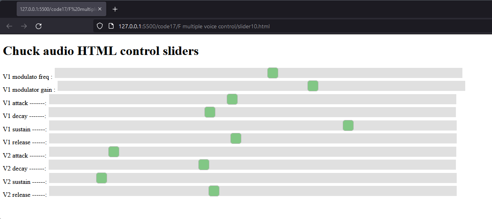
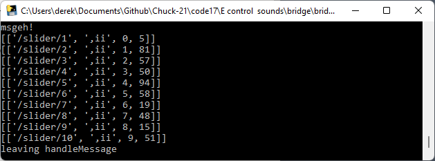
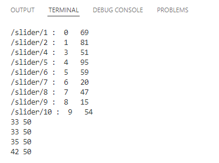

# Audio Programming F
## Using sliders to control two separate sounds

 Several parameters of a single sound have been controlled using HTML sliders.  Using the same principles and taking care about file and variable naming, two separate voices can be controlled.

 To achieve this two sounds must be created in two separate classes which we will call Sound1 and Sound2

 The keyboard map programme must send noteOn and noteOff messages to both sounds so that they play together at the same moment.

 The OscMonitor program must relay messages from the slider (via the bridge) to both sounds.

 The html slider page should contain enough sliders to control parameters of both sounds.  These should be labelled so that it is clear which sound each slider refers to.

 Each sound must respond only to the sliders which are intended to control it.

 

### Setting up two Sounds

The first sound will be in **Sound1.ck** which is copied from fm.ck.
Here's an extract from  **Sound1.ck**
```c
public class Sound1 extends Chubgraph
{
   //frequency modulation

   // control ranges max - min
   
   1000 =>    float mfmax;
   10   =>    float mfmin;
   
   10 =>      float mgmax;
   1  =>      float mgmin;
   
   0.2   =>   float amax;
   0.005 =>   float amin;
   
   0.8 =>     float dmax;
   0.01 =>    float dmin;
   
   1.0 =>     float smax;
   0.0 =>     float smin;

   0.8 =>     float rmax;
   0.05 =>    float rmin;


   // starting values
   20 =>    float mfreq;
   0 =>     float mgain;
   0.1 =>   float attack;
   0.1 =>   float decay;
   0.5 =>   float sustain;
   0.1 =>   float release;
 
   SinOsc modulator => SinOsc carrier => ADSR env => outlet;

   0.8 => carrier.gain;
   2   => carrier.sync;   
   mfreq => modulator.freq;  
   mgain => modulator.gain;

   env.set(attack :: second, decay :: second, sustain, release :: second);

   function void noteOn(float vel ){env.keyOn(1);}
   
   function void noteOff(float vel){ env.keyOff(1);}
   
   function void setFreq(float Hz){Hz => carrier.freq;}
```
This shows the set up of the range of control parameters , the sound patch leading to the outlet and the noteOn, noteOff and setFreq functions.

This is the same as a previous example except that the class name is changed to Sound1 matching the file name.

Now a second sound is set up in **Sound2.ck**  this is copied from the file **SoundSawEnvParam.ck** and has a relatively simple patch.

```c
public class Sound2 extends Chubgraph
{

   // control ranges max - min
 
   0.2   =>   float amax;
   0.005 =>   float amin;
   
   0.8 =>     float dmax;
   0.01 =>    float dmin;
   
   1.0 =>     float smax;
   0.0 =>     float smin;

   0.8 =>     float rmax;
   0.05 =>    float rmin;


   // starting values
   0.1 =>   float attack;
   0.1 =>   float decay;
   0.5 =>   float sustain;
   0.1 =>   float release;
   
```

The class is named as Sound2 to match the filename.

This patch will use an ADSR envelope, and so the ranges for the ADSR parameters can be set up in the same way as for Sound1.

Classes are independant of each other so the same variable names amax, amin e.t.c. can be used in Sound1 and Sound2 without any clash.

```c
   SawOsc s => ADSR env => outlet;
   0.6 => s.gain;

   env.set(attack :: second, decay :: second, sustain, release :: second);

   function void noteOn(float vel ){env.keyOn(1);}
   
   function void noteOff(float vel){ env.keyOff(1);}
   
   function void setFreq(float Hz){Hz => s.freq;}
```
The sound patch for this is quite simple, a sawtooth wave with an ADSR envelope.

NoteOn() and noteOff() functions are similar to Sound 1 and the setFreq() function sets the frequency of the Sawtooth oscillator.

### Playing two sounds from the keyboard

With two sounds in place the keyboard mapping programme will need to send messages out to both.  To denote this the file has been called **keyorganMapSporkDual.ck**  I am only showing extracts here which show how this has been adapted from the original version of keyorganMapSpork.ck.

```c
// Use keyboard Human interface device to play sound two separate files simoultaneously.
// Maps the keyboard keys asdf to notes cdef to match piano keyboard pattern
// chuck Sound1.ck Sound2.ck OscMonitorDual.ck keyorganMapSporkDual.ck
true =>int running;
Hid hi;
HidMsg msg;
int midiNote;
0.4   => float keyGain;
400.0 => float keyFreq;

```
The comment line which lists the chuck command to run the programmes has been ammended to the new file names.

A new variable keyFreq has been added.

Keyboard mapping for PC and Mac is unchanged so omitted here.

```c
// Use sound patch here with external class file
Sound1 snd1 => Gain master => dac;
Sound2 snd2 => master;
0.0 => snd1.noteOff;
0.0 => snd2.noteOff;
0.7 => master.gain;

OscMonitorDual oscmon;
spork ~ oscmon.oscGo(snd1, snd2);
spork ~ monitorKeyboard(snd1, snd2);
```
The sound patch has to draw in from both sound classes and these are represented by variable snd1 and snd2.

The master gain has been lowered to 0.7.  Whenever you are designing patches which combine sources you will need to control gains so that the combined sound does not clip at the output.

The programme has to reference the new OscMonitorDual class rather than the old OscMonitor class.

The functions oscGo() and monitorKeyboard() will need to be applied to two sounds so both snd1 and snd2 are sent as parameters.  This will mean that these function definitions will also need to be changed to match.

```c
function void monitorKeyboard(Sound1 snd1, Sound2 snd2){
    // infinite event loop till control key is pressed
    <<<"monitoring keyboard">>>;
    while( msg.which != 29 )
    {
        // wait for event
        hi => now;

        // get message
        while( hi.recv( msg ) )
        {
            // check
            if( msg.isButtonDown() )
            {
                <<<msg.which, map.cap()>>>;
                if(msg.which == 29) { false => running; me.exit();}
                if (msg.which < map.cap())
                {
                    map[msg.which] => midiNote;

                    if (midiNote >= 0){
                        Std.mtof( midiNote + 48 ) => keyFreq;
                        keyFreq => snd1.setFreq;
                        keyFreq => snd2.setFreq;
                        keyGain => snd1.noteOn;
                        keyGain => snd2.noteOn;

                    }
                }
            }
            else
            {
                0.0 => snd1.noteOff;
                0.0 => snd2.noteOff;
            }
        }
    }
}

```
The function is defined to recieve two parameters of type Sound1 and Sound2.  It is essential that the class names are correctly carried through the programme replacing any reference to the old Sound class and variable name snd.

When a keypress is detected the equivalent frequency is calculated and stored in keyFreq.  This allows keyFreq to be sent to the setFreq() functions of both sounds snd1 and snd2 without the need to repeat the calculation for each snd*n* variable.

Take care to ensure that both sounds recieve correct setFreq(), noteOn() and noteOff() function calls.

### Relaying messages to two sounds

The OscMonitor program will need to be altered so that it passes the incoming slider messages on to the two sounds.  The file **OscMonitorDual** is adapted from the previous OscMonitor.ck file.

```c
public class OscMonitorDual
{
 // shares osc control to different sounds
    OscIn oin;
    9999 => oin.port;
    oin.listenAll();
    OscMsg msg;
    int gui[2]; // will store value, controller and channel from gui 


    function void oscGo(Sound1 snd1, Sound2 snd2){  
        while(true)
        {
            oin => now;
            while(oin.recv(msg) != 0){    
                //<<<msg.address, "args: ",msg.numArgs()>>>; 
                for(int n; n < msg.numArgs(); n++){
                    if(msg.typetag.charAt(n) == 105 ){ // 105 ascii character 'i'
                        //<<<n, msg.typetag.charAt(n)>>>;
                        Std.abs(msg.getInt(n)) => gui[n];
                    }                 
                } 
                <<< msg.address,": ", gui[0]," ",gui[1] >>>;
                snd1.oscSlider( gui[0], gui[1]);  
                snd2.oscSlider( gui[0], gui[1]);                                     
            }
        }  
    }  
}
```
Only a few changes are needed here.  The function oscGo() must be redefined to accept two parameters of type Sound 1 and Sound2.  Correct naming is essential.

When messages are recieved they will be passed to the two sounds by calls to snd1.oscSlider() and snd2.oscSlider.

In this way both sounds will recieve all slider messages and it will be up to the programmer how to interpret these.

### Setting up sliders

The file **slider10.html** is adapted from fmcontrol.html all that needs to be done here is to increase the number of sliders and label them.

```javascript
     var msg =  {
                     "slider/1":[0, 5],
                     "slider/2":[1, 6],
                     "slider/3":[2, 0],
                     "slider/4":[3, 0],
                     "slider/5":[4, 0],
                     "slider/6":[5, 0],
                     "slider/7":[6, 0],
                     "slider/8":[7, 0],
                     "slider/9":[8, 0],
                     "slider/10":[9, 0],
      }
```
Near the top of the file the msg is extended to include sliders 7 - 10

```HTML
         <div class="slidecontainer">
            <label for="mySlider1">V1 modulato freq : </label>
            <input type="range" min="0" max="127" value="00" class="slider" id="mySlider1" oninput ="msg['slider/1'][1] = parseInt(this.value); WebSocketSend();"><br>
            <label for="mySlider2">V1 modulator gain : </label>
            <input type="range" min="0" max="127" value="00" class="slider" id="mySlider2" oninput ="msg['slider/2'][1] = parseInt(this.value); WebSocketSend();"><br>
            <label for="mySlider3">V1 attack -------:</label>
            <input type="range" min="0" max="127" value="00" class="slider" id="mySlider3" oninput ="msg['slider/3'][1] = parseInt(this.value); WebSocketSend();"><br>
            <label for="mySlider4">V1 decay  -------:</label>
            <input type="range" min="0" max="127" value="00" class="slider" id="mySlider4" oninput ="msg['slider/4'][1] = parseInt(this.value); WebSocketSend();"><br>
            <label for="mySlider5">V1 sustain ------:</label>
            <input type="range" min="0" max="127" value="00" class="slider" id="mySlider5" oninput ="msg['slider/5'][1] = parseInt(this.value); WebSocketSend();"><br>
            <label for="mySlider6">V1 release ------:</label>
            <input type="range" min="0" max="127" value="00" class="slider" id="mySlider6" oninput ="msg['slider/6'][1] = parseInt(this.value); WebSocketSend();"><br>
            <label for="mySlider7">V2 attack -------:</label>
            <input type="range" min="0" max="127" value="00" class="slider" id="mySlider7" oninput ="msg['slider/7'][1] = parseInt(this.value); WebSocketSend();"><br>
            <label for="mySlider8">V2 decay  -------:</label>
            <input type="range" min="0" max="127" value="00" class="slider" id="mySlider8" oninput ="msg['slider/8'][1] = parseInt(this.value); WebSocketSend();"><br>
            <label for="mySlider9">V2 sustain ------:</label>
            <input type="range" min="0" max="127" value="00" class="slider" id="mySlider9" oninput ="msg['slider/9'][1] = parseInt(this.value); WebSocketSend();"><br>
            <label for="mySlider10">V2 release ------:</label>
            <input type="range" min="0" max="127" value="00" class="slider" id="mySlider10" oninput ="msg['slider/10'][1] = parseInt(this.value); WebSocketSend();"><br>
        
         </div>
```

In the slidercontainer <div> additional sliders are added being careful to give them the correctly numbered slider id and oninput values.

V1 and V2 are added to the labels just to make it clearer which voice is being controlled by which slider.

### Two sounds respond to control

The first sound **Sound1.ck** already was programmed to respond to the first six sliders so nothing has to change here.

```c
   //=========== custom functions =============================
  
   // edit to set effect of each slider 
   function void oscSlider(int sliderNo, float value){  // value 0 - 127
      if(sliderNo == 0){ mfmin + ((mfmax - mfmin) * value/127 )  => modulator.freq;}
      if(sliderNo == 1){ mgmin + ((mgmax - mgmin) * value/127 )  => modulator.gain;}
      if(sliderNo == 2){ amin  + ((amax  - amin ) * value/127 )  => attack; 
            env.attackTime(attack :: second); }      
      if(sliderNo == 3){ dmin  + ((dmax  - dmin ) * value/127 )  => decay; 
            env.decayTime(decay :: second); }
      if(sliderNo == 4){ smin  + ((smax  - smin ) * value/127 )  => sustain; 
           env.sustainLevel(sustain); }
      if(sliderNo == 5){ rmin  + ((rmax  - rmin ) * value/127 )  => release; 
           env.releaseTime(release :: second); }                                  
   }  
}
```

I have chosen to make **Sound2.ck** ignore the first 6 sliders and respond to sliders 7 - 10 in a way which controls the ADSR.

```c
   //=========== custom functions =============================
  
   // edit to set effect of each slider 
   function void oscSlider(int sliderNo, int value){  // value 0 - 127
      if(sliderNo == 6){ amin  + ((amax  - amin ) * value/127 )  => attack; 
            env.attackTime(attack :: second); }      
      if(sliderNo == 7){ dmin  + ((dmax  - dmin ) * value/127 )  => decay; 
            env.decayTime(decay :: second); }
      if(sliderNo == 8){ smin  + ((smax  - smin ) * value/127 )  => sustain; 
           env.sustainLevel(sustain); }
      if(sliderNo == 9){ rmin  + ((rmax  - rmin ) * value/127 )  => release; 
           env.releaseTime(release :: second); }                                         
   } 
   
}
```

The code for ADSR control looks very similar between the two files it is only the slider number responded to which changes.

### Running the example

Ensure that the bridge program is running and then open the sliders in a browser. The chuck files are then ready to run 

> chuck Sound1.ck Sound2.ck OscMonitorDual.ck keyorganMapSporkDual.ck

The slider can be adjusted so that sound2 provides the attack and sound 2 sounds more slowly giving a development of tone through the sounding of each note.



The messages should be seen passing through the bridge.



These should flow to the terminal.  The terminal also responds to keypresses as the notes play.



You can experiment with controlling your own sounds.  You can create whatever control schemes you require.  For instance you might decide that the attack duration of sound 2 is always twice that of sound 1 and use a single slider to control these in a coupled manner.