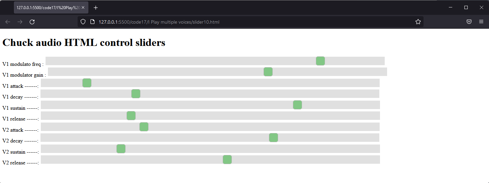

# Playback multi mdv parts with control

Now the two parts of this section are drawn together so that three melodies can be played together on three different sound patches with slider control.

* The three melodies were written in the musescore editor.

* Each part was exported to a separate xml file (using the uncompressed older format).
  
* Each xml file was converted to an abc file and the unwanted formatting information was cleaned up.
  
* Each abc file was converted to mdv format individually 

To play these back we will use trhee sound files with classes Sound1, Sound2 and Sound3.

The adjustments made to the oscMonitor to handle two sounds will need to be extended to three.

The file playback file will need to read three files into three separate groups of arrays representing three tracks to be played.  Each of these tracks will need a player function.

Care will be needed throughout to ensure that the classes and variable names for the three sounds are treated consistently.

The slider file from the previous example can be re-used by letting two of the sounds share the same ADSR settings.

Some adjustment to the sliders will be needed on playback to obtain a suitable sound and balance.

## Sound files to play back

The sound for the main melody is in **Sound1.ck** based on fm.ck and has been used before.

```c
public class Sound1 extends Chubgraph
{
   //frequency modulation

   // control ranges max - min
   
   1000 =>    float mfmax;
   10   =>    float mfmin;
   
   10 =>      float mgmax;
   1  =>      float mgmin;
   
   0.2   =>   float amax;
   0.005 =>   float amin;
   
   0.8 =>     float dmax;
   0.01 =>    float dmin;
   
   1.0 =>     float smax;
   0.0 =>     float smin;

   0.8 =>     float rmax;
   0.05 =>    float rmin;


   // starting values
   20 =>    float mfreq;
   0 =>     float mgain;
   0.1 =>   float attack;
   0.1 =>   float decay;
   0.5 =>   float sustain;
   0.1 =>   float release;
 
   SinOsc modulator => SinOsc carrier => ADSR env => outlet;

   0.8 => carrier.gain;
   2   => carrier.sync;   
   mfreq => modulator.freq;  
   mgain => modulator.gain;

   env.set(attack :: second, decay :: second, sustain, release :: second);

   function void noteOn(float vel ){env.keyOn(1);}
   
   function void noteOff(float vel){ env.keyOff(1);}
   
   function void setFreq(float Hz){Hz => carrier.freq;}
   
   //=========== custom functions =============================
  
   // edit to set effect of each slider 
   function void oscSlider(int sliderNo, float value){  // value 0 - 127
      if(sliderNo == 0){ mfmin + ((mfmax - mfmin) * value/127 )  => modulator.freq;}
      if(sliderNo == 1){ mgmin + ((mgmax - mgmin) * value/127 )  => modulator.gain;}
      if(sliderNo == 2){ amin  + ((amax  - amin ) * value/127 )  => attack; 
            env.attackTime(attack :: second); }      
      if(sliderNo == 3){ dmin  + ((dmax  - dmin ) * value/127 )  => decay; 
            env.decayTime(decay :: second); }
      if(sliderNo == 4){ smin  + ((smax  - smin ) * value/127 )  => sustain; 
           env.sustainLevel(sustain); }
      if(sliderNo == 5){ rmin  + ((rmax  - rmin ) * value/127 )  => release; 
           env.releaseTime(release :: second); }                                  
   }  
}
```

This will use the first 6 sliders to control the modulating frequency, the modulator gain and the ADSR settings.

The sound used for **Sound2.ck** is a sawtooth wave which has an ADSR envelope.  This has also been used before.

```c
public class Sound2 extends Chubgraph
{

   // control ranges max - min
 
   0.2   =>   float amax;
   0.005 =>   float amin;
   
   0.8 =>     float dmax;
   0.01 =>    float dmin;
   
   1.0 =>     float smax;
   0.0 =>     float smin;

   0.8 =>     float rmax;
   0.05 =>    float rmin;


   // starting values
   0.1 =>   float attack;
   0.1 =>   float decay;
   0.5 =>   float sustain;
   0.1 =>   float release;
   

   SawOsc s => ADSR env => outlet;
   0.6 => s.gain;

   env.set(attack :: second, decay :: second, sustain, release :: second);

   function void noteOn(float vel ){env.keyOn(1);}
   
   function void noteOff(float vel){ env.keyOff(1);}
   
   function void setFreq(float Hz){Hz => s.freq;}
   
   //=========== custom functions =============================
  
   // edit to set effect of each slider 
   function void oscSlider(int sliderNo, int value){  // value 0 - 127
      if(sliderNo == 6){ amin  + ((amax  - amin ) * value/127 )  => attack; 
            env.attackTime(attack :: second); }      
      if(sliderNo == 7){ dmin  + ((dmax  - dmin ) * value/127 )  => decay; 
            env.decayTime(decay :: second); }
      if(sliderNo == 8){ smin  + ((smax  - smin ) * value/127 )  => sustain; 
           env.sustainLevel(sustain); }
      if(sliderNo == 9){ rmin  + ((rmax  - rmin ) * value/127 )  => release; 
           env.releaseTime(release :: second); }                                         
   } 
   
}
```
Finally the third sound **Sound3.ck** is simply a sine wave oscillator with and ADSR.

```c
public class Sound3 extends Chubgraph
{


   // control ranges max - min
 
   0.2   =>   float amax;
   0.005 =>   float amin;
   
   0.8 =>     float dmax;
   0.01 =>    float dmin;
   
   1.0 =>     float smax;
   0.0 =>     float smin;

   0.8 =>     float rmax;
   0.05 =>    float rmin;


   // starting values

   0.9 => float attack;
   0.1 => float decay;
   0.5 => float sustain;
   0.1 => float release;


   SinOsc s => ADSR env => outlet;
   1 => s.gain;

   env.set(attack :: second, decay :: second, sustain, release :: second);
   <<<env.state()>>>; // print env state 0 atack 1 decay 2 sustain 3 release 4 done


   function void noteOn(float vel ){env.keyOn(1); <<<env.state()>>>;}
   
   function void noteOff(float vel){ env.keyOff(1); <<<env.state()>>>;}
   
   function void setFreq(float Hz){Hz => s.freq;}
   
 //=========== custom functions =============================
  
   // edit to set effect of each slider 
   function void oscSlider(int sliderNo, int value){  // value 0 - 127
      if(sliderNo == 6){ amin  + ((amax  - amin ) * value/127 )  => attack; 
            env.attackTime(attack :: second); }      
      if(sliderNo == 7){ dmin  + ((dmax  - dmin ) * value/127 )  => decay; 
            env.decayTime(decay :: second); }
      if(sliderNo == 8){ smin  + ((smax  - smin ) * value/127 )  => sustain; 
           env.sustainLevel(sustain); }
      if(sliderNo == 9){ rmin  + ((rmax  - rmin ) * value/127 )  => release; 
           env.releaseTime(release :: second); }                                         
   } 
   
}
```
The ADSR settings of the last two sounds are connected to the same sliders so will match each other.  You could add more sliders if you wanted individual control.

## Monitoring OSC messages for three sounds

The file ***OSCMonitorSplit.ck** is a simple adaptation of OSCMonitorDual.ck adding in a third sound.

```c
public class OscMonitorSplit
{
 // setup osc
 // splits osc control to different sounds by slider number
    OscIn oin;
    9999 => oin.port;
    oin.listenAll();
    OscMsg msg;
    int gui[2]; // will store value, controller and channel from gui 


    function void oscGo(Sound1 snd1, Sound2 snd2, Sound3 snd3){  
        while(true)
        {
            oin => now;
            while(oin.recv(msg) != 0){    
                //<<<msg.address, "args: ",msg.numArgs()>>>; 
                for(int n; n < msg.numArgs(); n++){
                    if(msg.typetag.charAt(n) == 105 ){ // 105 ascii character 'i'
                        //<<<n, msg.typetag.charAt(n)>>>;
                        Std.abs(msg.getInt(n)) => gui[n];
                    }                 
                } 
                <<< msg.address,": ", gui[0]," ",gui[1] >>>;
                snd1.oscSlider( gui[0], gui[1]);  
                snd2.oscSlider( gui[0], gui[1]);  
                snd3.oscSlider( gui[0], gui[1]);                                    
            }
        }  
    }     
}
```
The function oscGo now takes three sounds as arguments and calls the oscSlider function on each sound.

## Playing back three tracks

The file **triReaderParam.ck** is based on the mdvPlayer.ck with some sections repeated three times and edited to the three tracks.

```c
//ode to joy using single sound in separate class file
//Now reading note arrays form a file
//chuck Sound1.ck Sound2.ck Sound3.ck OscMonitorSplit.ck triReaderParam.ck:name

120 => float tempo;

60/(tempo * 192) => float tick;

int   Notes1[0];  
int   Durs1[0]; 
float Velocities1[0];

int   Notes2[0]; 
int   Durs2[0]; 
float Velocities2[0];

int   Notes3[0] ;    
int   Durs3[0]; 
float Velocities3[0];
string filename;

10 => int gap1;
15 => int gap2;
05 => int gap3;
```
There are three setss of note, duration, velocity arrays which will hold the data for the three tracks.

Because the three sounds will be different, there is scope for them to use different gap settings.

```c
// replace sound patch here with external class file
Sound1 snd1 => Gain master =>dac;
Sound2 snd2 => master;
Sound3 snd3 => master;
0.3 => master.gain;

0.0 =>snd1.noteOff;
0.0 =>snd2.noteOff;
0.0 =>snd3.noteOff;
```
The sound patch brings in the trhee sounds and mixws them into a master gain.  The gain setting of the master is reduced to 0.3 to prevent clipping.

Each of the sounds is initially silenced.

```c
if(me.args()){
    "mdv/"+ me.arg(0)+"1.txt" => filename;
}   
retrieve(Notes1, Durs1, Velocities1);
```

The filename is read in from the chuck command line.  It is assumed that the three files to be read will be numbered 1,2 and 3.

```c
if(me.args()){
    "mdv/"+ me.arg(0)+"2.txt" => filename;
}   
retrieve(Notes2, Durs2, Velocities2);

if(me.args()){
    "mdv/"+ me.arg(0)+"3.txt" => filename;
}   
retrieve(Notes3, Durs3, Velocities3);
```
It is assumed that the three files to be read will be numbered 1,2 and 3.

The retrieve function has now been called three times and all trhee groups of arrays are populated with track data.

```c
Event start;

OscMonitorSplit oscmon;
spork ~ oscmon.oscGo(snd1, snd2, snd3);

spork ~ player1(Notes1, Durs1, Velocities1, snd1, start, gap1);
spork ~ player2(Notes2, Durs2, Velocities2, snd2, start, gap2);
spork ~ player3(Notes3, Durs3, Velocities3, snd3, start, gap3);

1.0 * second => now;
start.broadcast();

while(true){// main loop
    100::second => now;
}; 
```

The revised monitor class OscMonitorSplit is used to monitor the sliders (via the bridge).

The calls to the player functions will now need to identify which sound is to be played for each track.

There is a 1 second pause just to demonstrate that when the start event is broadcast all three tracks start to play simoultaneously in their own timeline.

The while loop leaves the main program marking seconds, all the audio activity is happening in the sporked threads.

```c
// ------------------------ file reading function ------------------------------//

function void retrieve(int notes[], int durations[], float velocities[] ){
    int cap;
    // flags: READ_WRITE, READ, WRITE, APPEND, BINARY, ASCII combine with | bitwise or.
    me.sourceDir() + "/" + filename => string filepath;
    FileIO datafile;
    datafile.open(filepath, FileIO.READ | FileIO.ASCII  );
    Std.atoi( datafile.readLine()) => cap;
    //<<< "array length " ,cap >>>;
    cap => notes.size;
    cap => durations.size;
    cap => velocities.size;
    for( 0 => int i; i < cap; i++ ){Std.atoi(datafile.readLine())=>(notes[i]);}
    for( 0 => int i; i < cap; i++ ){Std.atoi(datafile.readLine())=>(durations[i]);}
    for( 0 => int i; i < cap; i++ ){Std.atof(datafile.readLine())=>(velocities[i]);}
    datafile.close();
    //<<<cap, notes ,durations, velocities >>>; // prints pointer to arrays not array values.
}
```
The file reading function is unchanged,
```c
//---------------------- voice playing functions --------------//

function void player1(int N[], int D[], float V[], Sound1 generator, Event start,  int gap){
    while( true){
        //0 => s.gain ;
        start => now;
        for (1 => int i; i <= 4; i++) {// four repeats
            for (1 =>int index; index < N.cap(); index ++){ //for each element of the array
                Std.mtof(N[index])      => generator.setFreq;
                V[index]   * 0.2    => generator.noteOn;
                (D[index]-gap)* tick :: second => now;
                0.0 => generator.noteOff;
                gap * tick :: second => now;
            }
        }
    }
}
```
The voice playing function is similar to the original, but it needs an extra parameter to note which sound is to be played.  In this case Sound1 is passed as generator.
```c
function void player2(int N[], int D[], float V[], Sound2 generator, Event start, int gap){
    while( true){
        //0 => s.gain ;
        start => now;
        for (1 => int i; i <= 4; i++) {// four repeats
            for (1 =>int index; index < N.cap(); index ++){ //for each element of the array
                Std.mtof(N[index])      => generator.setFreq;
                V[index]   * 0.2    => generator.noteOn;
                (D[index]-gap)* tick :: second => now;
                0.0 => generator.noteOff;
                gap * tick :: second => now;
            }
        }
    }
}

function void player3(int N[], int D[], float V[], Sound3 generator, Event start, int gap){
    while( true){
        //0 => s.gain ;
        start => now;
        for (1 => int i; i <= 4; i++) {// four repeats
            for (1 =>int index; index < N.cap(); index ++){ //for each element of the array
                Std.mtof(N[index])      => generator.setFreq;
                V[index]   * 0.2    => generator.noteOn;
                (D[index]-gap)* tick :: second => now;
                0.0 => generator.noteOff;
                gap * tick :: second => now;
            }
        }
    }
}

```
The second ant third player functions are almost copies of the first but they do need to be written out again because the definitions include the Sound classes which will be used for the generator parameter.

## Play back demo

With the slider open in the browser and the bridge running in the background the demo can be played.

> chuck Sound1.ck Sound2.ck Sound3.ck OscMonitorSplit.ck triReaderParam.ck:OdeToJoy

Sliders can be adjusted for a suitable blend of sound.



This demo should be a basis to use as a starter for CW2.