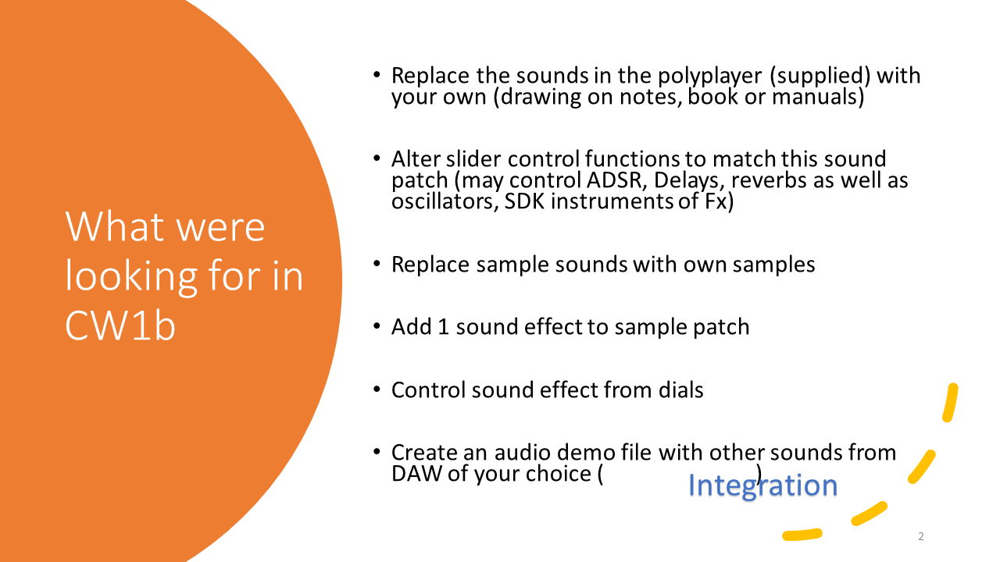
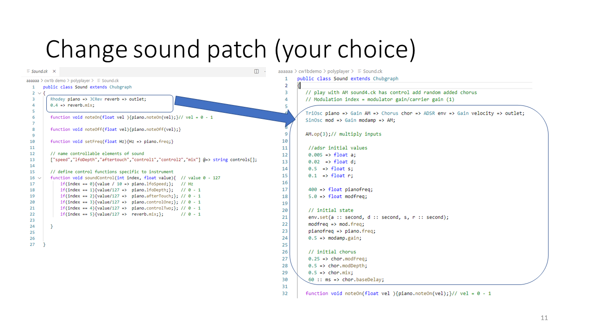
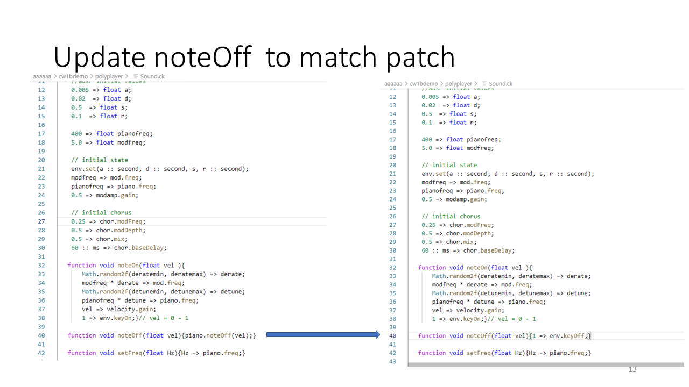
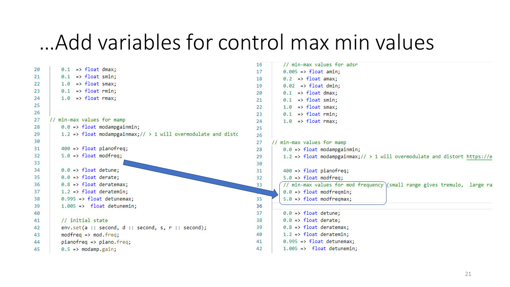
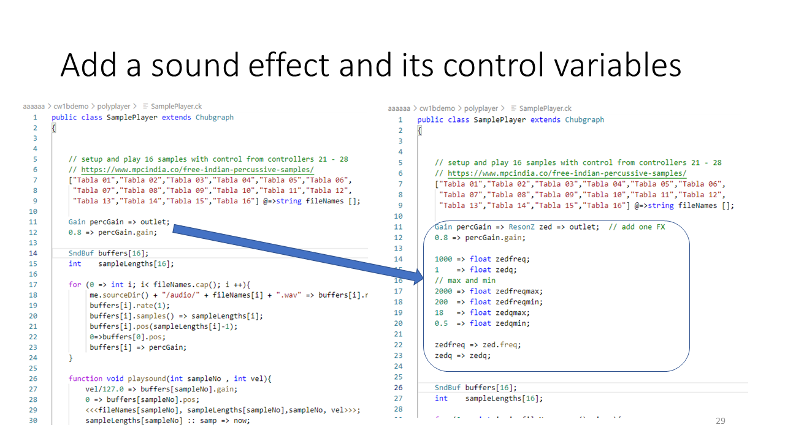
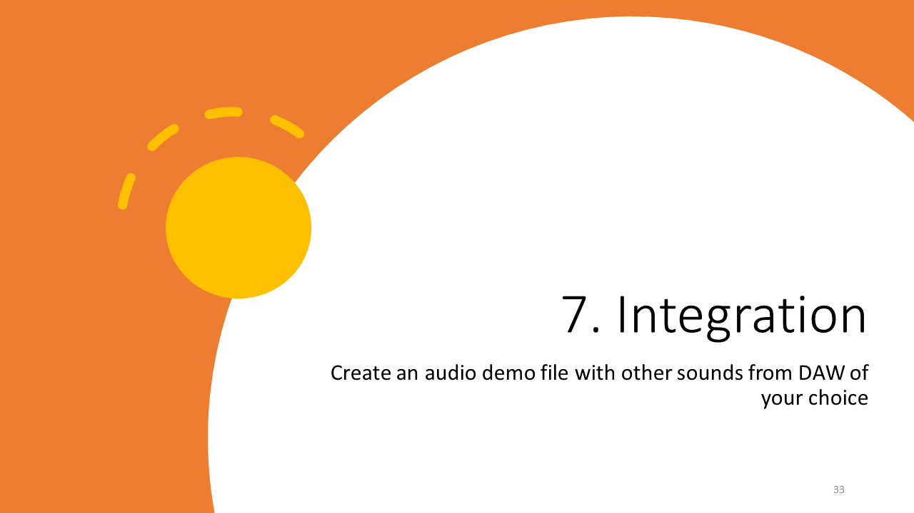
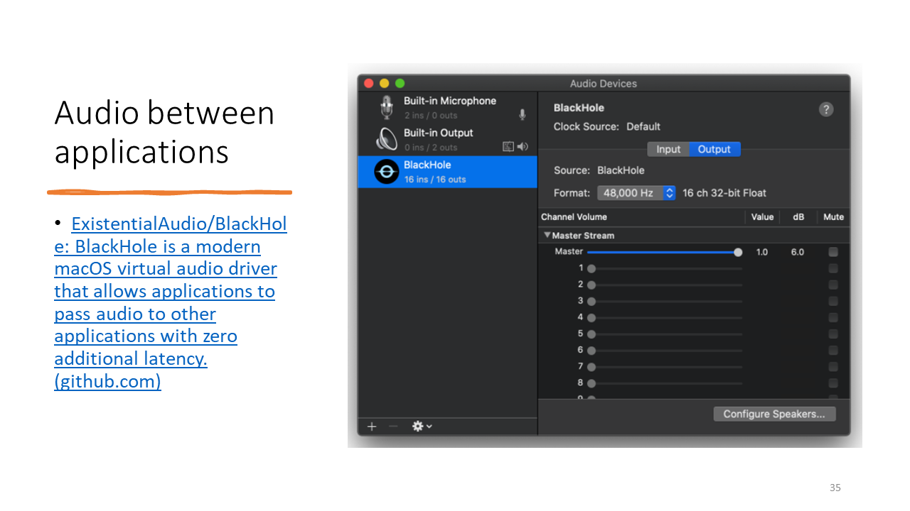
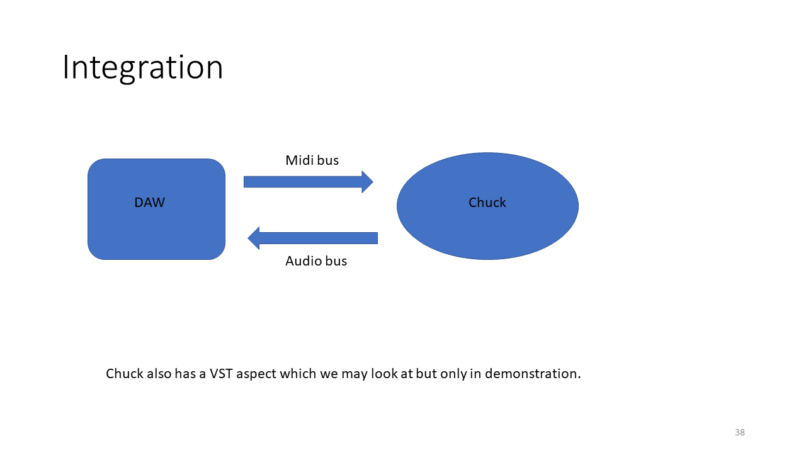

# Run Through CW1c 

This run through shows the process steps needed to complete cw1c.  You are expected to customise the solution ot your own sounds and not reproduce this solution.

## section

