# Run Through CW1c 

This run through shows the process steps needed to complete cw1c.  You are expected to customise the solution ot your own sounds and not reproduce this solution.

## intro

You can base your sound file changes on the sounds you produced for CW1b of create a new sound.  The principle is to create a single sound file which has enough parameters to be capable of control making a clear audible difference.

The sliders will now be the hardware sliders of a control keyboard or the GUI keyboard emulator, but the structiure of the code will be similar to the HTML sliders already encountered.

In CW1a a single sample sound was  changed, now you should find replacement samples for 16 wave files.

A sound effect can be followed by a sound effect, pan, filter, reverb e.t.c. the playback rate of a sample is controlled within the starter file.  You should modify a couple of controls to influence these sound effect parameters.

Demonstrate the usefulness of the patch by recording some audio.

## Setup

You should already have gone some way towards setup with the graphic user interface set up, but I inlude this a s a reminder.

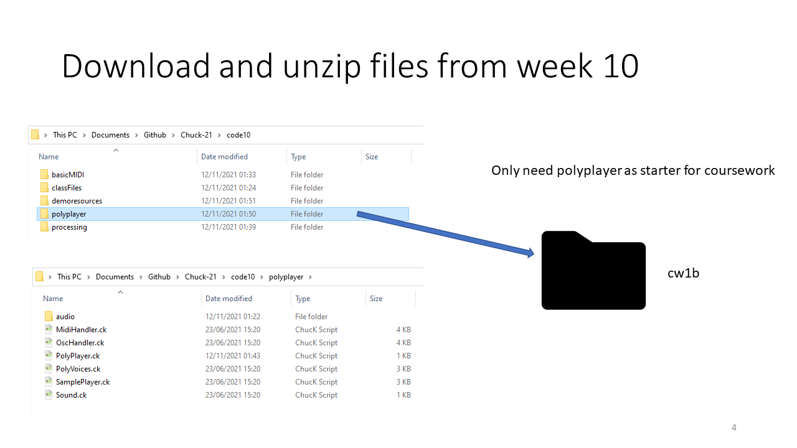

The relevant starter files can be downloaded in the resit download code18.zip.  The starter code is in the polyplayer folder in section K.

Review the files supplied with the demo code and be sure you are comforable with the folder structure and location of sample files.

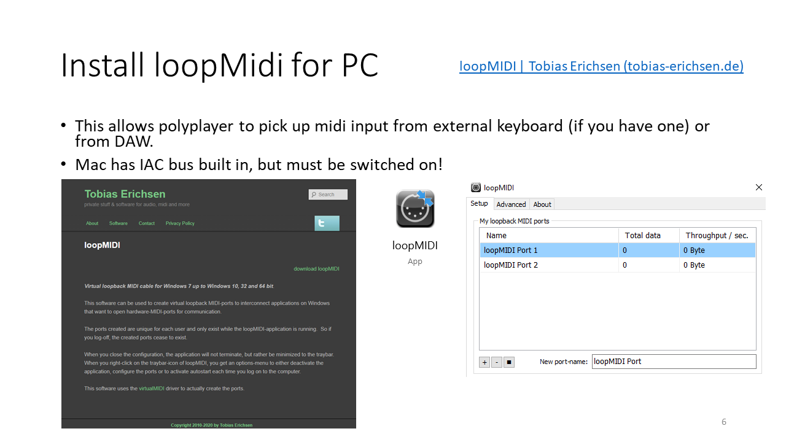

Loop MIDI for pc will allow the polyplayer to be driven from a DAW.  This would be the last stage of the coursework in order to produce a  good audio file from the customized polyplayer.

A mac already has an internal midi bus in the form of IAC.  This can be turned on from the audiomidi settings.

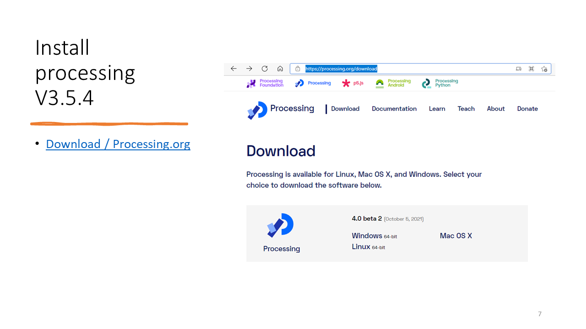

You should already have installed processing, either version 3 or version 4 beta will do.

This shows the set up of the library code oscP5 using processing version 3.  This library is essential to allow the GUI to issue osc commands.

When Gui 9 is run it can be auditioned with the downloaded polyplayer files.  The dials and sliders will effect control.  The keyboard running MIDI channel 1 will play synthesised notes.  Using midi MIDI channel 10, the lower keyboard notes will play each of the demo samples.

## Sound customisation

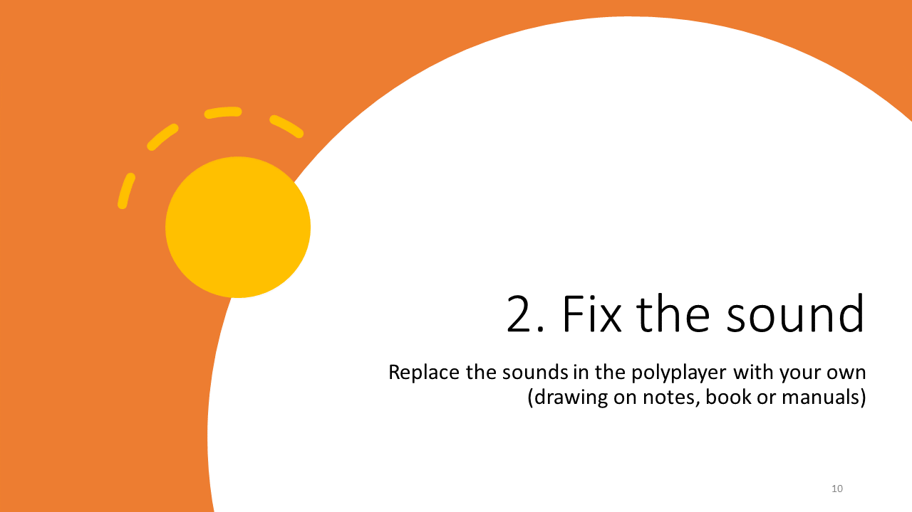

Now the process of customisation is started.  The files in the Sound class in Sound.ck should be modified to your own original sound patch based on patches in the notes.  A more original sound patch will attract higher marks.

The patch still has a patch with a source named piano.

Here the contents of the sound pach are replaced with and AM based sound patch.  A chorus effect has been added after the multiplying gain AM.  This gives more scope for parameters to control.  You should put your own sound patch variant here.  Refer to the floss manual if you want to add any additional effects.

Once the sound patch is changed the noteOn, noteOff and setFreq functions will need to be reconsidered.  In this example noteOn sounds the note by triggering the ADSR envelope rather than calling the noteOn function of an STK instrument UGEN.  Some randomisation and detuning has also been added here to make the sound more interesting for repeated notes.  Randomisation achieves a more realistic effect, but the range of random parameters has to be carefully tested to ensure the effect remains musical. 

In this example, noteOff triggers the release phase of the envelope.  You will need to customise this function to match your sound patch.

Because I wanted to recalculate frequencies to add randomisation I found it usefull to store the frequency in a variable pianofreq rather than setting the frequency of an oscillator directly.  Again this function should be customised to match your sound patch.

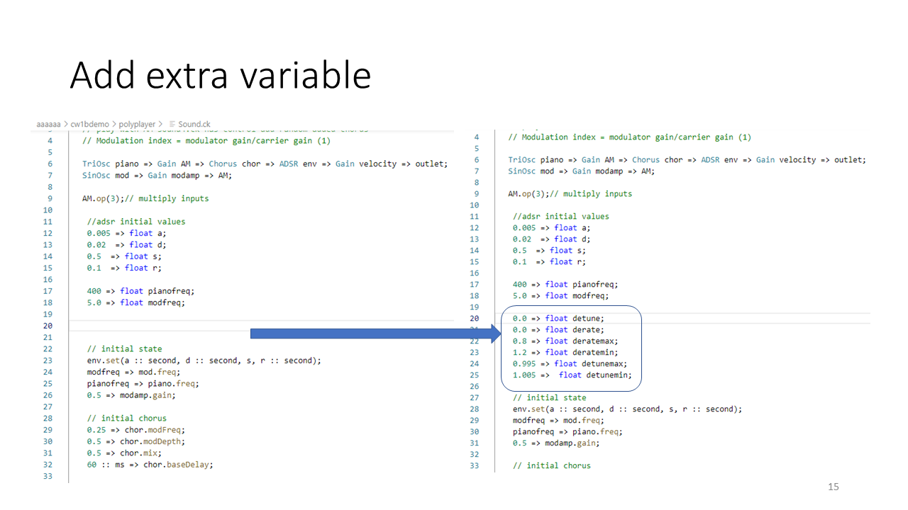

Because I want to use randomisation between max and min values for the derate and detune variables I can introduce variables for this including max and min values.

The addition of variables used in setting sound patch parameters increases the range of possibilities for slider control.

Any parameter to be controlled by slider should have a starting value and max and min values set.

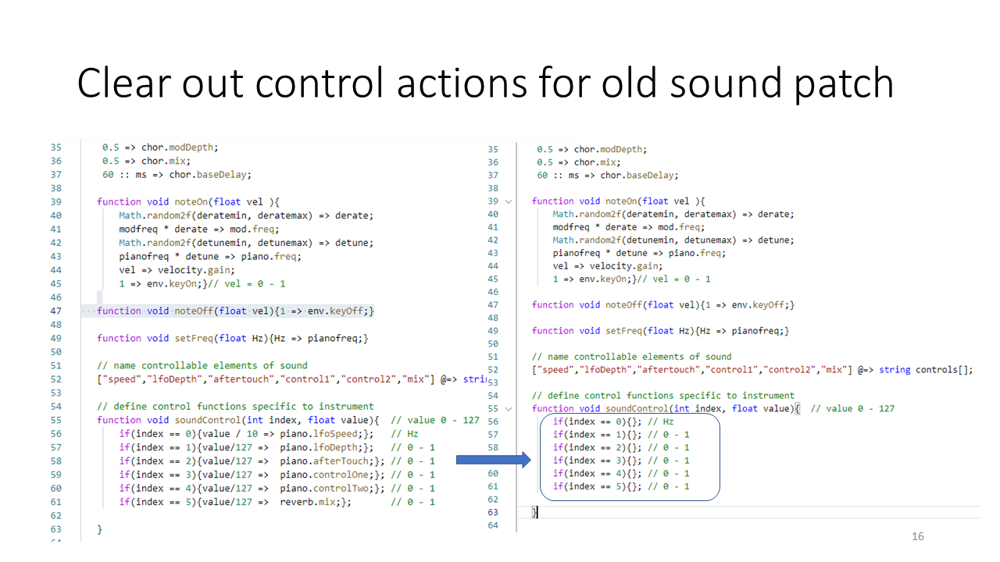

The details in the soundControl function are unlikely to be correct for your new sound patch so if you leave the detail in then moving sliders will lead to an error.  I suggest empty brackets for each of the control actions which can then be filled out later.

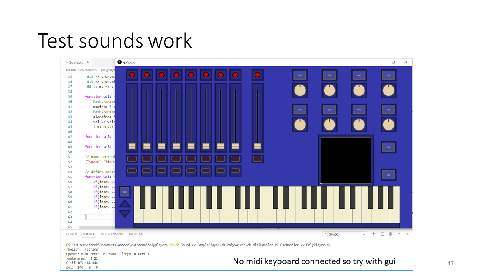

Test that your sound still works and that you have a musically useful sound which has the potential to create a useable polyphonic audio track.

## Slider Control

Now it is time to reinstate the slider control, one line at a time checking that the programme still works after each line change.

You can be creative in determining what parameters to control, but it is wise to include and ADSR somewhere.  If you are not confident you could add only and ADSR then apply and audition control before you attempt anything more complex.

Here I have added maximum and minimum values for each parameter used.  This includes the modulation amplitude and the chorus frequency and depth parameters. 

Here I have also added control parameters for ADSR with starting values.

Finally I have added variables for the maximum and minimum modulation frequency.  

Now the control actions are added to the soundControl function following standard patterns for parameter scaling.  Add your own control lines one at a time and check the effect of each individually before moving on.

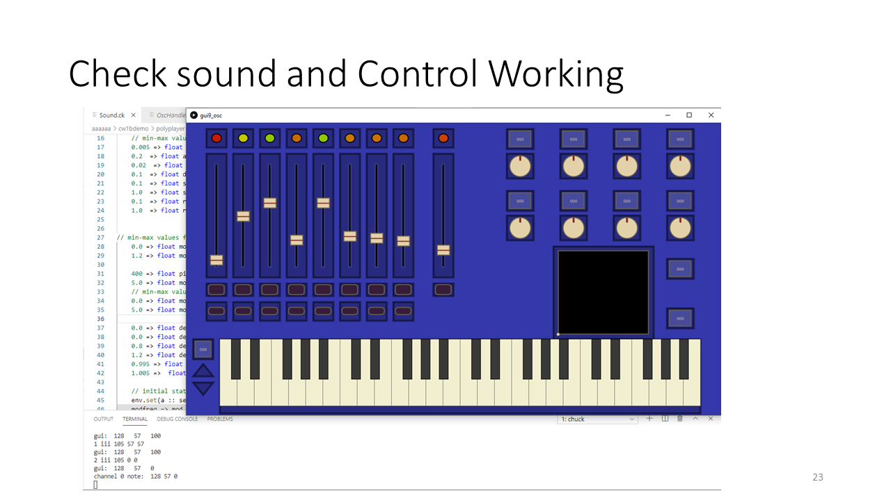

At this point you should have a patch which responds to the control keyboard sliders.  Keep a backup of your progress so far.

## Customising samples

Next task is to swap out the demo sample wav files for your own.  Changing 16 is not really any more difficult than changing just one, you just need to be carefull with naming and spelling.

In this example I have replaced the demo samples with a set of 16 tabla samples downloaded from the web.  It makes life easier to rename the replacement wav files so that the name is short and the numbering scheme is easy to follow.  

You can delete the demo wav files from the audio folder to keep the size of the hand in zip file down.

To use the new set of samples all that is needed is to accurately replace the names in the fileNames array.  Any innacuracy will cause a problem here,

If you have downloaded samples you can add a comment which identifies the source with in the code.

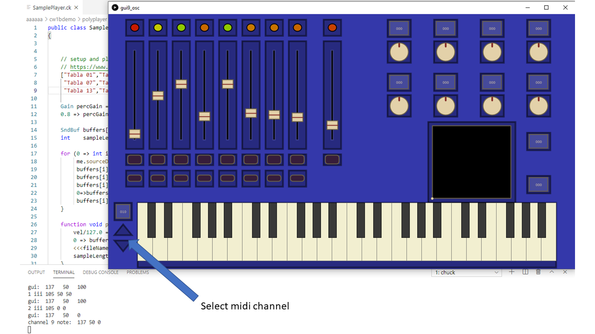

The samples can now be auditioned by setting the keyboard to midi hardware channel 10 (which is channel 9 in software because there we start numbering form zero rather than one).

Keep a backup of your work so far.

## Sound effect on samples

The playback rate of a sample can be varied.  The starting position could also be set to a number other than zero so that the initial transient of the sound was lost.  However, the easiest way to demonstrate control is to add a sound effect to the sound patch after the sample buffer and apply control to this using keyboard dials.

With a limitted number of dials you will not be able to control all aspects of 16 samples.

In this example a resonant filter selected from the floss manual has been added after the gain unit which the samples link into.  This filter can have variable cuto off frequency and Q factor.

Add a sound effect of your choice to the sample patch.

## Dial control of sound effect

Next step will be to reassign just a couple of the dial controls which are currently controlling playback spead.

Here dials 1 and 2 are used to control the filter frequency and filter Q.

You could add other effects such as reverb or delay or other filters.

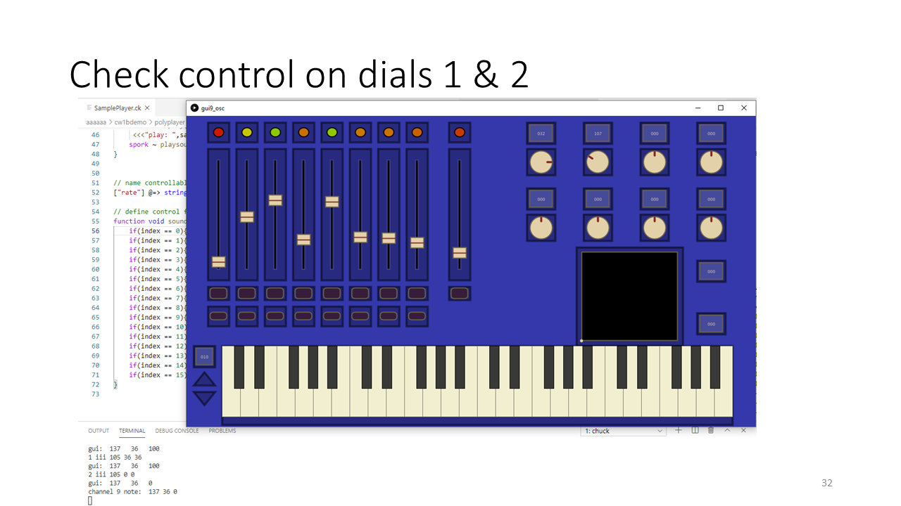

Audition your dial control and back up your progress so far.

## Audio demo

The final step is to make a piece of audio which reflects the usefulness of the patch.  If you have keyboard skills you could do this simply by playing a short piece on the keyboard and recording the output.

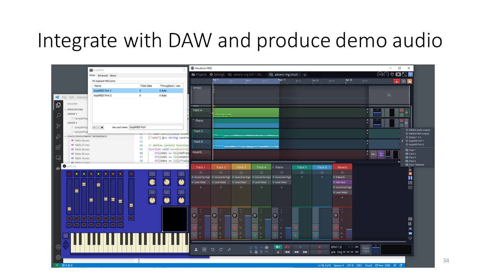

If you are not a keyboard player you could load a keyboard demo piece into a DAW and play the chuck audio from this.

To do that you would point your DAW MIDI output to a midi bus (loop midi or IAC) and make sure that the midi port setting of the polyplayer was correct to take MIDI imput from this instead of the keyboard.

Remember the chuck --probe command to see details of available ports.

The figure here illustrates the free DAW "Tracktion Waveform" but the same can be done form Reaper of Logic.

Now you want the audio output of chuck to be recorded using a recording programme or your DAW to record onto a different track.

On a MAC the chuck output can be directed to black hole and the DAW can use this as an input.

On PC you can download VBpaudio virtual cable and this will provide a simple and free link between audio programmes.

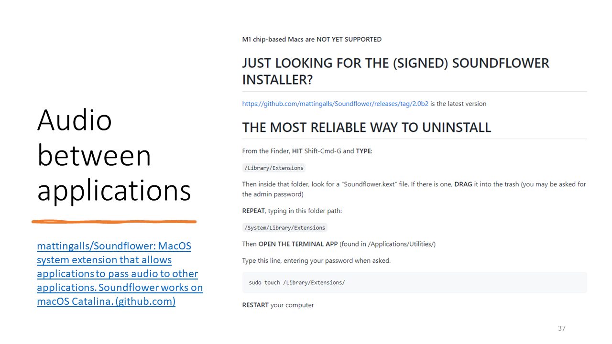

On old style Macs where black hole will not run you can use the older application soundflower (which does the same thng as black hole.)

The audio flow is now out from DAW via midi bus to chuck and back via and audio bus to the DAW

You will need to output chuck to the correct dac in order to pass sound back to the DAW.

The demo files in code18 section L show an illustration of what a customised polyplayer might look like.  You should not aim to reproduce this demo file exactly in your coursework.